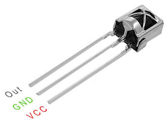
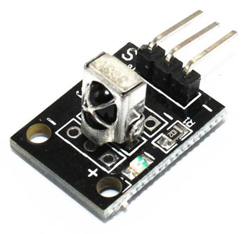
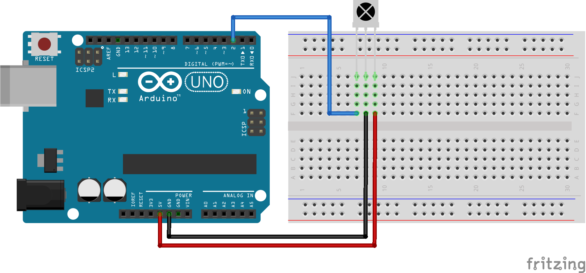

### [IR-ChrissTree]()

### [Инфракрасный пульт на смартфоне для всего и Arduino](IR-ChrissTree/IR-ChrissTree.md)

#### Brief Note (краткая заметка)

<b><i>

>
Новый Год встретили, а Рождество еще не наступило, мы зашевелились - Таня занялась вязанием и своими вязальными семинарами, а я откопал старый  Redmi Note 4 и думаю: "Что это телефон пропадает, сделаю-ка я из него универсальный пульт".
> 
Занялся. Снял на компьютере коды пульта телевизора, коды для подсветки штор. Бар работает на блютуз, сделаю на следующие новогодние каникулы; сейчас, всё равно, не успею. Ну, думаю, заодно и ёлку подключу к пульту. Коды для включения-выключения придумаю, микроконтроллер запрограммирую.
>
Перебрал удлинитель, сделал выход на реле для подключения к контроллеру. Малость попаял, пристегнул к ёлке датчик, понюхал канифоли, собрал все в кучу. Написал программу для ёлки. В смартфон загрузил все коды.
>
[VK, 2024.01.08](https://vk.com/tve58)

</b></i>

В этом материале будет рассказано, как сделать инфракрасный пульт из смартфона для управления домашней техникой, а именно, в моём конкретном случае, универсальный пульт для управления телевизором, подсветкой штор и включением-выключением Новогодней ёлки.

Для реализации проекта понадобится следующее:

<i>

- смартфон, имеющий источник инфракрасного излучения (в моем случае использовался [Redmi Note 4](https://4pda.to/2016/10/16/327024/));

- универсальный пульт дистанционного управления. В настоящее время их существует множество: Galaxy Universal Remote, Samsung Universal TV Remote, Universal Remote for Smart TVs и т.д. Можно использовать любой пульт, который позволяет самостоятельно формировать наборы кодов для управления оборудованием. Я использовал установочный файл приложения [Galaxy Universal Remote v4.1.3 (3.92 МБ)](https://4pda.to/forum/index.php?showtopic=486223&st=280#entry56438437);

- среда разработки скетчей и их загрузки в контроллер - IDE [Arduino 1.8.18](https://sourceforge.net/projects/arduino.mirror/files/1.8.18/) или более поздней версии;

- контроллер (например, [Arduino UNO](https://arduino.ru/Hardware/ArduinoBoardUno));

- [ИК-датчик VS1838B](https://dinistor.ru/product/215), приёмник инфракрасных сигналов на частоте 38 кГц (или модуль KY-022 с инфракрасным датчиком)

</i>

<i>

</i>

#### [1. Выбор кодов для универсального пульта](#%D0%B2%D1%8B%D0%B1%D0%BE%D1%80-%D0%BA%D0%BE%D0%B4%D0%BE%D0%B2-%D1%83%D0%BD%D0%B8%D0%B2%D0%B5%D1%80%D1%81%D0%B0%D0%BB%D1%8C%D0%BD%D0%BE%D0%B3%D0%BE-%D0%BF%D1%83%D0%BB%D1%8C%D1%82%D0%B0)

#### [2. Библиография материалов](#%D0%B1%D0%B8%D0%B1%D0%BB%D0%B8%D0%BE%D0%B3%D1%80%D0%B0%D1%84%D0%B8%D1%8F)

#### Выбор кодов универсального пульта

Существует несколько протоколов кодирования инфракрасных импульсов. Все протоколы изучать не будем и используем только два: протокол, который используется в приложении Galaxy Universal Remote и протокол NEC физической передачи импульсов на несущей частоте 38 кГц.

Первая задача, которая стоит перед нами - это подобрать набор кодов для загрузки в пульт. Для её решения соберем схему на базе Arduino Uno и напишем программный скетч для её работы.

Схема простая. На макетной плате размещаем инфракрасный датчик VS1838B. Соединяем сигнальный контакт со вторым цифровым входом контроллера, соединяем "земли" сенсора (датчика) и контроллера и подаем 5В с контроллера на датчик. Вся основная работа будет делаться в программе. Для подбора кодов будем подавать команды с пульта телевизора и с пульта освещения штор. Для включения/выключения ёлочной гирлянды придумаем или подберем свои коды.

#### Библиография:

[Ардуино: инфракрасный пульт и приемник - Олег Евсегнеев](https://robotclass.ru/tutorials/arduino-ir-remote-control/)

[Как подключить инфракрасный сенсор к Arduino](https://soltau.ru/index.php/arduino/item/553-kak-podklyuchit-infrakrasnyj-sensor-k-arduino)

[Как работает инфракрасный пульт? Поясняем - Dmitry LOOKin](https://vc.ru/tech/868613-kak-rabotaet-infrakrasnyy-pult-poyasnyaem)

[Описание протокола Nec](https://chipenable.ru/index.php/item/96)

---

[Подключение реле к Ардуино (SRD-05VDC-SL-C)](https://arduino-site.ru/modul-rele/)

[HOW TO SET UP A 5V RELAY ON THE ARDUINO](https://www.circuitbasics.com/setting-up-a-5v-relay-on-the-arduino/)

[Поиск "arduino и SRD 05VDC-SL-C"](https://yandex.ru/search/?text=arduino+и+SRD+05VDC-SL-C&clid=2261451&banerid=6301000000%3ASW-694005a33c95&win=513&lr=18)

---

[Fritzing  1.0.1](https://pikabu.ru/story/fritzing_101_10994263)

[Fritzing 0.9.9](https://vk.com/wall-97877471_760378)

#### Универсальный пульт для домашней техники на смартфоне ("ещё одно" приложение для смартфона

Никаких необходимых внешних аппаратных средств. Не требуется сетевое подключения. Разрешения не требуется!

Управляйте телевизором, ТВ-приставкой,кондиционером,цифровой или зеркальной фотокамерой.

Если вы заметили какие-либо ошибки, или ваше устройство не поддерживается, пожалуйста, свяжитесь с нами по support@moletag.com и мы исправим его для вас! Кроме того, если вам не понравиться приложения просто пришлите нам ваши детали заказа, и мы вернем вам деньги.

Примечание: 

Это приложение работает только с телефонами, которые имеют встроенный ИК-передатчик (в настоящее время Samsung Galaxy S4, Galaxy Note 3, Galaxy Note 8.0, Galaxy Note 10.1, Galaxy Tab 7.0 Plus, Galaxy Tab 2, Galaxy Tab 3, Galaxy Mega).

В настоящее время поддержка более 350 000 устройств

#### [Как загрузить коды в Galaxy S4 Universal Remote 4.1.3.](https://4pda.to/forum/index.php?showtopic=486223&st=360#entry65481762)

#### Рекомендация с 19-той страницы

Инструкция по загрузке кодов:

1) Качаем:

а) [Galaxy Universal Remote v3.4.9c.apk](https://4pda.to/forum/index.php?showtopic=486223&st=200#entry46652802)

б) [IR_codes.txt](https://ds-blobs-1.cdn.devapps.ru/7485567/IR_codes.txt?s=009b1dfdb213fd6e65927b70000000009426fcafe359dce83f6d75e3aaf45c3c)

в) [Galaxy Universal Remote v4.1.3.apk](https://4pda.to/forum/index.php?showtopic=486223&st=280#entry56438437)

2) устанавливаем Galaxy Universal Remote v3.4.9c.apk

3) ir_codes.txt копируем в внутреннюю SD память телефона [android/data/com.moletag.galaxy.s4.remote/files/]. 

##### Замечание 2024.01.03: Каталог был невидим с внешнего компьютера. Пришлось перебрасывать в каталог Download, а затем проводником перекидывать в родной каталог, который был виден в проводнике.

4) заходим в программу на вкладку мои пульты и по + добавляем новый пульт

5) заходим в наш созданный пульт и добавляем куда-нибудь новую кнопку

6) тапаем по новой кнопке и добавляем действие - ввести свой ИК-код

7) в нижнем левом углу тап по кнопке с листом бумаги - открыть папку и выбирать наш файл ir_codes.txt

8) После чего коды загрузятся в телефон и на вкладке мои пульты появятся 3 пульта: IR_codes, IR_codes2, IR_codes3 в которых полно кнопок с нашими загруженными кодами!

9) устанавливаем последнюю версию, в нашем случае - Galaxy Universal Remote v4.1.3.apk, и имеем последнюю версию с пультами IR_codes, IR_codes2, IR_codes3

11) идем к устройству с ИК датчиком, например, к древнему телику, которого нет в списке стандартных устройств и подбираем коды из пультов IR_codes, IR_codes2, IR_codes3 !

12) А далее творим и создаем свой пульт

13) Если все получилось - можно выразить благодарность ув. Alex0047 и ув. egortimofeyev003

