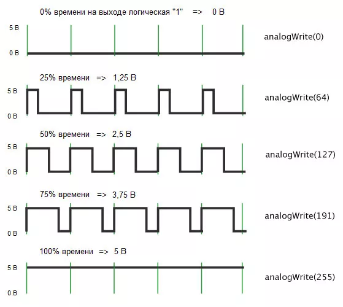

## Паровозик КРУТЯК

### [1. Прo ШИМ](#%D0%BF%D1%80%D0%BE-%D1%88%D0%B8%D0%BC)
### [2. Прo полевой транзистор IRFZ24N](#%D0%BF%D1%80%D0%BE-%D0%BF%D0%BE%D0%BB%D0%B5%D0%B2%D0%BE%D0%B9-%D1%82%D1%80%D0%B0%D0%BD%D0%B7%D0%B8%D1%81%D1%82%D0%BE%D1%80-irfz24n)

#### [2024-03-10](#) Разборка паровоза и идея.

1. Система управления от ИК-датчика и пульта:
```
1п - "начать движение";
2п - "стоп паровоз";
3п - "быстрее";
4п - "медленнее";
```
2. Скорость паровоза изменяется в "дискретах" от 0 до 255. "Пакет дискрет" - программно изменяемое количество дискрет, которое определяет как изменяется скорость (на какое количество дискрет) при нажатии на клавиши "быстрее" или "медленнее".

#### [2024-03-11](#) 
Собрал простейшую схему управления скоростью вращения электромотора с помощью переменного резистора с использованием [ШИМ](#%D0%BF%D1%80%D0%BE-%D1%88%D0%B8%D0%BC) (англ. PWM, широтно-импульсной модуляцией). 

#### [Скетч простейшей схемы управления скоростью вращения электромотора](upravlyaem-skorostyu-ehlektromotora/upravlyaem-skorostyu-ehlektromotora.ino) 

В скетче используется полевой транзистор [IRFZ24N](#%D0%BF%D1%80%D0%BE-%D0%BF%D0%BE%D0%BB%D0%B5%D0%B2%D0%BE%D0%B9-%D1%82%D1%80%D0%B0%D0%BD%D0%B7%D0%B8%D1%81%D1%82%D0%BE%D1%80-irfz24n). Это позволяет не менять мощности двигателя при изменении скорости. Скетч отслеживает положение потенциометра и преобразовывает его в сигнал ШИМ, который с пина контроллера D10 попадает на затвор полевого транзистора VT1. Транзистор работает в режиме ключа и выполняет роль драйвера, позволяя управлять двигателем, не нагружая выход Arduino.

Таким образом скетч выполняет задачу установления сигнала ШИМ на выходе с коэффициентом заполнения, прямо пропорциональным уровню сигнала на аналоговом входе. 


#### [2024-03-12](#) Система контроля и протокола.
Мысль такая. В следующем вагоне после паровоза находится СКИП - система контроля и протокола: с ИК-датчиком тоже (или команда будет приходить от системы управления паровозом). Если будет второй датчик, то он должен будет ловить сигналы от пульта вместе с ИК-датчиком паровоза. Все действия отображаются на мониторе ().

### Про ШИМ

Некоторые из цифровых выходов Arduino способны чередовать "0" и "1" с частотой ***490 Гц*** с заданным коэффициентом заполнения (длительностью импульсов), позволяя получить на выходе определенное напряжение. Чем больше длительность импульсов, тем выше напряжение. Коэффициент заполнения ШИМ указывается от ***0 (0%)*** до ***255 (100%)***. Функция ***analogWrite(pin, value)*** (где pin - порт входа/выхода на который подаётся ШИМ сигнал; value - коэффициент заполнения, значение между 0 (полностью выключено) and 255 (сигнал подан постоянно)) выдает аналоговую величину (ШИМ волну) на порт входа/выхода. После вызова analogWrite() на выходе будет генерироваться постоянная прямоугольная волна с заданной шириной импульса до следующего вызова analogWrite (или вызова digitalWrite или digitalRead на том же порту входа/выхода).

 

### Про полевой транзистор IRFZ24N

IRFZ24N является мощным n-канальным МОП (MOSFET) транзистором. 

#### Замечание
> Ардуино, при выдаваемых на контакт ***5В*** выдерживает ток в ***40мА***. Мощные моторы или сверхъяркие светодиоды могут потреблять сотни миллиампер. При подключении таких нагрузок напрямую чип может быстро выйти из строя. Кроме того для работоспособности некоторых компонентов требуется напряжение большее, чем 5В.
> 
> Зато, его с лёгкостью хватит для управления транзистором, который в свою очередь будет управлять большим током (например для подключения длинной светодиодной ленты, которая требует 12В и при этом потребляет 100мА).


[Характеристики](https://shematok.ru/transistor/irfz24n)
```
Максимальное напряжение сток-исток (Uси):    55В;
Максимальный продолжительный ток стока (Iс): 17А;
Максимальный импульсный ток стока (Iс):      68А;
Ток утечки стока:                            25мкА (при Uси = 55В);
Ток утечки затвора:                          100нА (при Uзи = 20В);
Сопротивление открытого канала (Rси):        70мOм (0.07Ом);
Пороговое напряжение затвор-исток (UGS):     2... 4В;
Максимальное напряжение затвор-исток (Uзи):  ±20В;
Максимальная рассеиваемая мощность (Pси):    45Вт;
Крутизна характеристики:                     4,5S;
Время задержки включения:    4,9нс (при Uси = 28В, Iс = 10A);
Время задержки выключения:    19нс (при Uси = 28В, Iс = 10A);
Корпус:                                      ТО-220;

--- Максимальная температура канала (Tj) - этот параметр ограничивает 
    температуру канала транзистора во включенном состоянии. Если ее превысить,
    срок службы транзистора может сократиться.

--- Общий заряд затвора (Qg) — заряд, который нужно сообщить затвору 
    для открытия транзистора. Чем меньше этот параметр, тем меньшая мощность
    требуется для управления транзистором.

--- Время нарастания (tr) - время, за которое ток стока увеличится 
    с 10% до 90% от указанного.
    
--- Сопротивление сток-исток открытого транзистора (Rds) - сопротивление
открытого канала сток-исток при заданных параметрах: Id, Vgs и Tj.
```
#### Замечание
> При работе с MOSFET транзисторами нужно учесть, что они могут быть повреждены статическим электричеством на ваших руках или одежде. Перед монтажом на печатную плату необходимо соединить выводы транзистора между собой тонкой проволокой. Для пайки лучше используйте паяльную станцию, а не обычный электрический паяльник. Вместо отсоса для удаления припоя используйте медную ленту для удаления припоя. Это уменьшит вероятность пробоя затвора статическим электричеством. Или используйте антистатический браслет.
> 

---

0

1

2

3

4

5

6

7

8

9

A

B

C

D

E

F

###### [в начало](#%D0%BF%D0%B0%D1%80%D0%BE%D0%B2%D0%BE%D0%B7%D0%B8%D0%BA-%D0%BA%D1%80%D1%83%D1%82%D1%8F%D0%BA)
