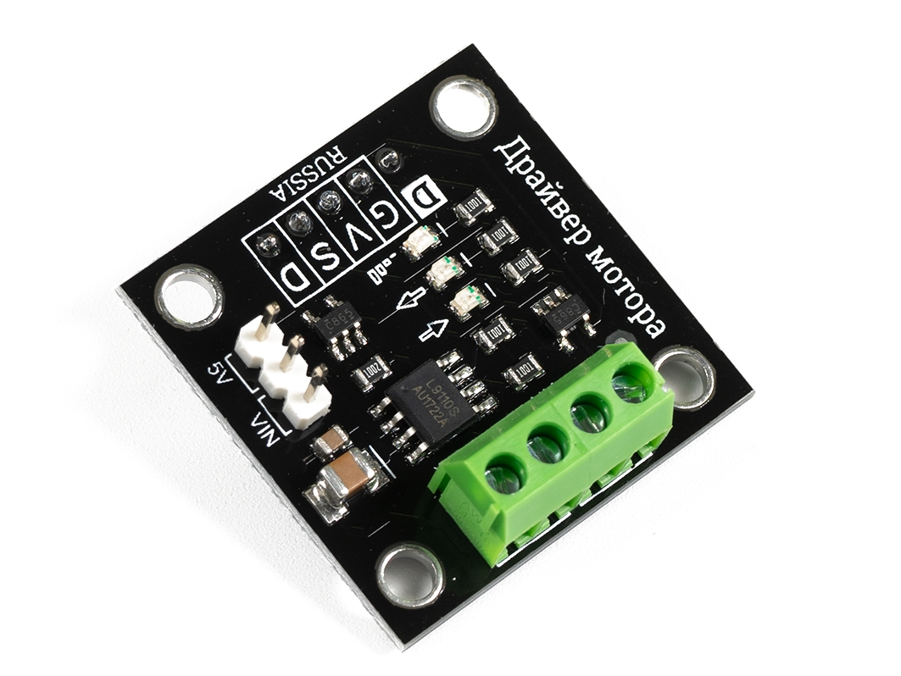
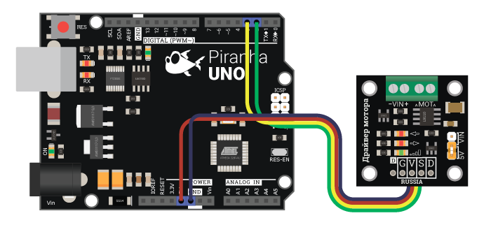
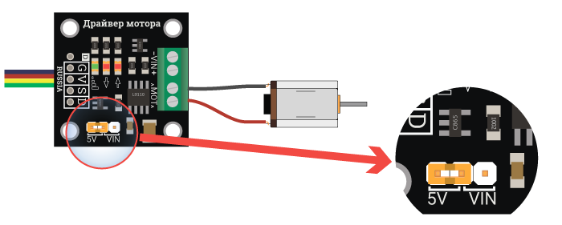
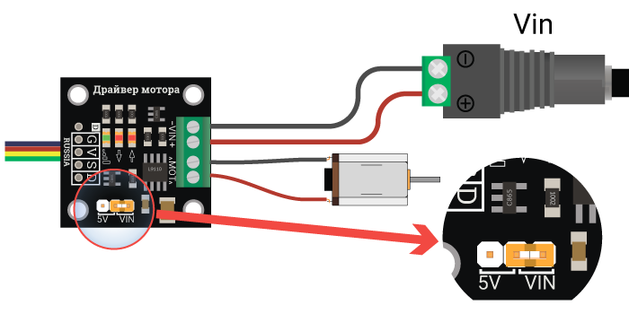

## Паровозик КРУТЯК - новые детали проекта

### [Драйвер мотора - артикул 1372](https://iarduino.ru/shop/Expansion-payments/drayver-motora-trema-modul.html)



Драйвер мотора - модуль собранный на основе чипа L9110, что позволяет управлять коллекторными моторами с с током потребления до 300 мА.

```
Напряжение питания логики модуля:       5 В;
Напряжение питания мотора:              2,5 - 12 В;
Ток потребляемый модулем без нагрузки:  < 50 мкА;
Номинальный ток нагрузки:               300 мА;

Логический уровень:                     5V;
Направление:                            цифровой;
Скорость:                               ШИМ;
Рабочая температура:                    от 0 до +80 °С;
Габариты:                               30 х 30 мм;
Вес:                                    6 г.
```

**[Wiki - Драйвер мотора](https://wiki.iarduino.ru/page/trema-modul-motor-driver/)**

Подключение c использованием проводов и Arduino UNO:

```
Вывод Arduino	Вывод модуля
    2	            D
    3	            S
   5V	            V
  GND	            G
```



#### Два способа подключения нагрузки:

1. С питанием от отладочной платы Arduino. При таком подключении мотор будет питаться от 5 вольт, через провода подключения к отладочной плате.



2. С питанием от внешнего источника. При таком подключении мотор будет питаться от внешнего источника питания от 2,5 до 12 вольт.



Модуль позволяет управлять скоростью и направлением вращения коллекторных моторов с потреблением тока до 300 мА. Модуль собран на базе чипа L9110, в отличии от подобных модулей на данном чипе в нём реализована активная развязка управляющего сигнала, что позволит не нагружать выводы Arudino.

#### [Скетч изменения направления вращения](izmenenie-napravleniya-vrashcheniya/izmenenie-napravleniya-vrashcheniya.ino)

В данном примере мотор будет вращаться сначала в одну сторону с максимальной скоростью в течении двух секунд, затем остановится на одну секунду и начнёт вращаться в другую.

#### [Скетч плавного старта](plavnyj-start/plavnyj-start.ino)

В данном примере мотор будет плавно набирать скорость вращения, а затем так же плавно останавливаться.


### [Драйвер моторов двухканальный DRV8833](https://iarduino.ru/shop/Expansion-payments/drayver-motorov-dvuhkanalnyy-drv8833.html)

Драйвер DRV8833 позволяет управлять двумя коллекторными моторами или одним шаговым двигателем. Внутрисхемно чип драйвера содержит два независимых H-моста (канала A и B) рассчитанных на напряжение от 2,7 до 10,8 В, при рабочем токе каждого канала до 0,5 А без радиатора, или до 1,5 А с радиатором установленном на чипе. Пиковый ток до 2 А на каждый канал.

***Увеличить рабочий ток можно путём параллельного объединения двух каналов драйвера в один, тогда можно управлять одним коллекторным двигателем с тем же диапазоном напряжений и рабочим током двигателя до 1 А без радиатора, или до 3 А с радиатором установленном на чипе. Объединение каналов осуществляется соединением следующих выводов: IN1=IN3, OUT1=OUT3, IN2=IN4, OUT2=OUT4.***


###### [в начало](#%D0%BF%D0%B0%D1%80%D0%BE%D0%B2%D0%BE%D0%B7%D0%B8%D0%BA-%D0%BA%D1%80%D1%83%D1%82%D1%8F%D0%BA)
