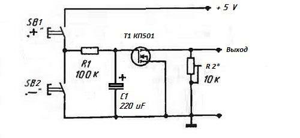
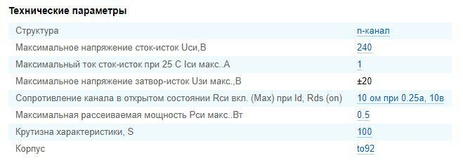

## [Электронный потенциометр]()

Радиолюбители практически всегда применяют переменные резисторы для регулировки громкости или напряжения и прибор с кнопками на лицевой панели смотрится более интересно и современно, чем с обыкновенными ручками-крутилками.

Основу схемы составляет полевой транзистор КП 501 (или любой другой его аналог). 

Нажимая кнопку SB1, мы накапливаем заряд на электролитическом конденсаторе С1, что позволяет приоткрыть транзистор и повлиять на сопротивление на выходных клеммах схемы. Нажимая кнопку SB2, мы разряжаем конденсатор С1, что приводит к постепенному закрыванию транзистора. При постоянном зажатии, какой либо из кнопок, изменения сопротивления производиться плавно.

Плавность регулировки такого электронного переменного резистора зависит от емкости конденсатора С1 и номинала резистора R1. Максимальное сопротивление, которое способна имитировать схема зависит от подстроечного резистора R2. Схема начинает работать сразу и дополнительной настройки не требует, кроме как подстройки максимального сопротивления резистором R2.

После отключения питания схемы, такой электронный переменный резистор не сбрасывает настройки сразу, а сопротивление схемы увеличивается постепенно, что связанно с саморазрядом конденсатора С1. При использовании нового и качественного конденсатора С1 настройки схемы могут продержаться около суток.

Наверное, самым востребованным применением этой схемы станет электронный регулятор громкости. Такая электронная регулировка громкости не лишена своих недостатков, но важнейшим фактором для радиолюбителей наверняка станет простота повторения. 

Схема имеет малые габариты, выполняет функцию обыкновенного переменного резистора. Основу схемы составляет полевой транзистор ***КП 501*** (или любой другой его аналог).

#### Библиография:

[Электронный переменный резистор](https://diodnik.com/elektronnyj-peremennyj-rezistor/)

[Электронный переменный резистор (электронный потенциометр)](https://community.alexgyver.ru/threads/ehlektronnyj-peremennyj-rezistor-ehlektronnyj-potenciometr.316/)

###### [в начало](#%D0%BF%D0%B0%D1%80%D0%BE%D0%B2%D0%BE%D0%B7%D0%B8%D0%BA-%D0%BA%D1%80%D1%83%D1%82%D1%8F%D0%BA)
