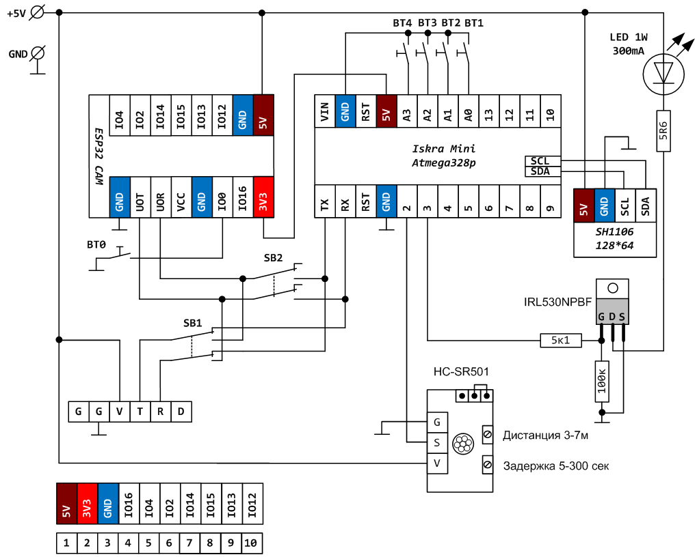

## [Kvizzy - Фотоловушка на даче](https://zen.yandex.ru/media/esp32/foto-lovushka-na-esp32-cam-svoimi-rukami-60db589d7403af22afc89a33) 

### Как это работает?

- датчик движения подключенный к Arduino Mini обнаружив около миски кота зажигает светодиод, который используется в качестве вспышки и отправляет через интерфейс UART плате ESP32 CAM символ # , после чего переходит в ожидание от платы ESP32 CAM символа @

- плата ESP32 CAM получив через последовательный порт символ # делает фотографию и сохраняет её на SD карту. (в качестве имени файла фотографии используется текущая дата-время /например p20210622_045715.jpg/, которую ESP32 получает из сети Интернет - таким образом фотки легко сортировать и не будет повторяющихся имен)

- плата ESP32 Cam отправляет последнюю записанную фотографию с карты памяти по электронной почте

- пауза 15 сек (чтобы не заспамить собственный почтовый ящик, например если вдруг коты надумают под камерой "выяснить отношения")

- плата ESP32 Cam отправляет по UART символ @ после чего ждет новой команды от Arduino - символ #

Таким образом все фотографии которые были сняты при обнаружении движения сохраняются и локально на карте памяти и отправляются на e-mail.

Размер одной фотографии всего около 100 кб, так что 16Гб флеш карты хватит на долго, и принять такой объем данных даже если в поездке будет плохой Интернет тоже не проблема.

> Имейте ввиду что большинство примеров, которыми завален Интернет по работе с ESP32 CAM, используют для работы с SD картой аппаратную шину SDMMC, а библиотека почтового клиента от mobizt общается с карточкой с использованием шины SPI так что объединить 2 скетча "в лоб" не получится. В свой код я вносил поправки и сохраняю данные с камеры используя шину SPI, а не SDMMC.

**an549**

Ваша статья заинтересовала меня и я повторил ваше устройство. Правда вместо ИК датчика движений использовал микроволновый RCWL-0516 (фиксирует движение даже через стену), а также Ардуино Про Мини на Atmega328, что в принципе сути не меняет. Все питается от 5В, кроме светодиода. В его цепи поставил стабилизатор AMS1117 3,3 без всяких сопротивлений. Он как раз выдает ток на диод 300 мА.

### [Последовательная связь между Arduino и ESP32 CAM](https://www.programmingboss.com/2023/01/serial-communication-between-arduino-and-esp32-CAM-UART-data-communication.html#gsc.tab=0)

#### [ESP32, Arduino и 3 аппаратных последовательных порта](https://quadmeup.com/arduino-esp32-and-3-hardware-serial-ports/)

#### [Урок 26.1 Соединяем две arduino по шине UART](https://lesson.iarduino.ru/page/urok-26-1-soedinyaem-dve-arduino-po-shine-uart#:~:text=Таким%20образом%20значение%20по%20умолчанию,бита%20равна%201%20битовому%20интервалу)

#### [How to establish a serial communication between an ESP32 s3 dev kit c module and Arduino board](https://forum.arduino.cc/t/how-to-establish-a-serial-communication-between-an-esp32-s3-dev-kit-c-module-and-arduino-board/1139692)

### [Kvizzy1 - первушечка](kvizzy1-pervushechka/kvizzy1-pervushechka.md)

### [LCD 1602 русский шрифт на Ардуино](https://роботехника18.рф/русский-шрифт-ардуино/)

***2024-08-16***. Решено выводить всякую информацию о процессах с фотоловушкой (а может и не только с ней) на маленький монитор LCD 1602 c I2C.

Пока по проводам на Ардуино, а потом может и через WiFi.

### Библиография

#### [2020-12-31 => ESP32 CAM подключение и прошивка](https://dzen.ru/a/X6HVz138lCrXj9qF)

#### [2021-01-12 => ESP32 CAM PINOUT и внешняя Wi Fi антенна](https://dzen.ru/a/X_iqa7sU1U_7kgTl)

#### [2021-01-19 => ESP32 CAM самодельная плата расширения](https://dzen.ru/a/YAYDyR9DXlLUBed1)

#### [2021-07-01 => Фото-ловушка на ESP32 CAM своими руками (e-mail)](https://dzen.ru/a/YNtYnXQDryKvyJoz?share_to=link)

#### [2022-06-30 => Фото-ловушка на ESP32 CAM своими руками (Telegram)](https://dzen.ru/a/Yr1MFCHCYGuW_akT?share_to=link)

###### [в начало](#kvizzy)

0

1

2

3

4

5

6

7

8

9

0

1

2

3

4

5

