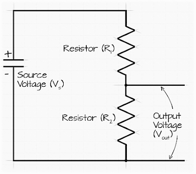
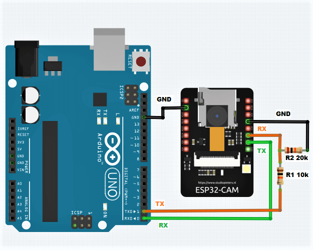
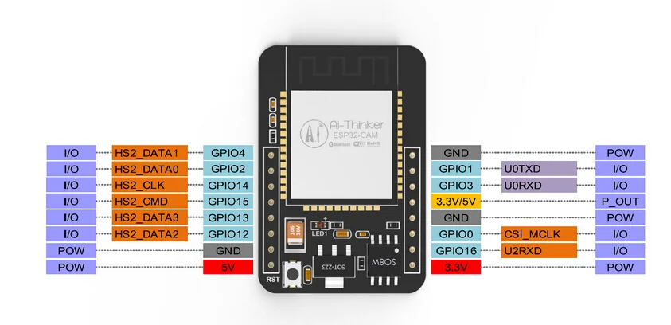
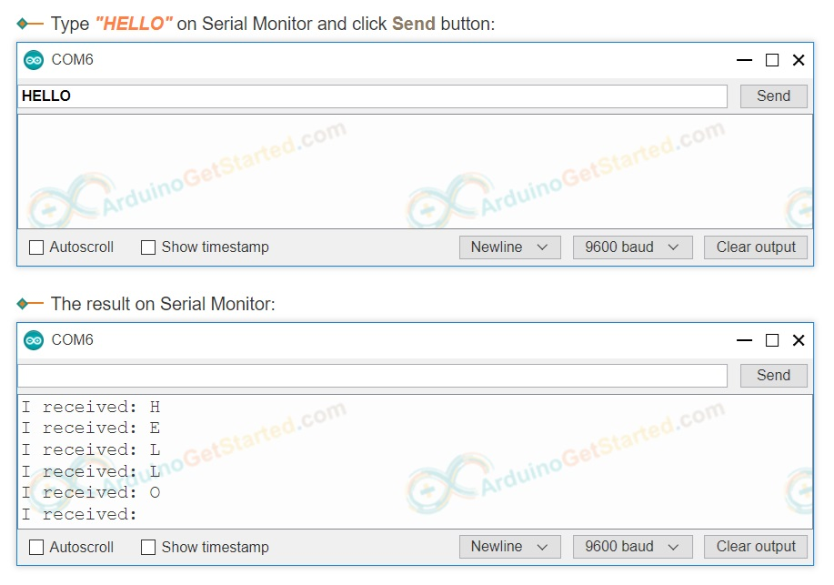

## [Kvizzy - Фотоловушка на даче](https://zen.yandex.ru/media/esp32/foto-lovushka-na-esp32-cam-svoimi-rukami-60db589d7403af22afc89a33) 


### Как это работает?

- датчик движения подключенный к Arduino Mini обнаружив около миски кота зажигает светодиод, который используется в качестве вспышки и отправляет через интерфейс UART плате ESP32 CAM символ # , после чего переходит в ожидание от платы ESP32 CAM символа @

- плата ESP32 CAM получив через последовательный порт символ # делает фотографию и сохраняет её на SD карту. (в качестве имени файла фотографии используется текущая дата-время /например p20210622_045715.jpg/, которую ESP32 получает из сети Интернет - таким образом фотки легко сортировать и не будет повторяющихся имен)

- плата ESP32 Cam отправляет последнюю записанную фотографию с карты памяти по электронной почте

- пауза 15 сек (чтобы не заспамить собственный почтовый ящик, например если вдруг коты надумают под камерой "выяснить отношения")

- плата ESP32 Cam отправляет по UART символ @ после чего ждет новой команды от Arduino - символ #

Таким образом все фотографии которые были сняты при обнаружении движения сохраняются и локально на карте памяти и отправляются на e-mail.

Размер одной фотографии всего около 100 кб, так что 16Гб флеш карты хватит на долго, и принять такой объем данных даже если в поездке будет плохой Интернет тоже не проблема.

> Имейте ввиду что большинство примеров, которыми завален Интернет по работе с ESP32 CAM, используют для работы с SD картой аппаратную шину SDMMC, а библиотека почтового клиента от mobizt общается с карточкой с использованием шины SPI так что объединить 2 скетча "в лоб" не получится. В свой код я вносил поправки и сохраняю данные с камеры используя шину SPI, а не SDMMC.

**an549**

Ваша статья заинтересовала меня и я повторил ваше устройство. Правда вместо ИК датчика движений использовал микроволновый RCWL-0516 (фиксирует движение даже через стену), а также Ардуино Про Мини на Atmega328, что в принципе сути не меняет. Все питается от 5В, кроме светодиода. В его цепи поставил стабилизатор AMS1117 3,3 без всяких сопротивлений. Он как раз выдает ток на диод 300 мА.

### [ESP32-CAM - справочник по распиновке](https://lastminuteengineers.com/esp32-cam-pinout-reference/)


### [Последовательная связь между Arduino и ESP32 CAM](https://www.programmingboss.com/2023/01/serial-communication-between-arduino-and-esp32-CAM-UART-data-communication.html#gsc.tab=0)

Соединение [двух устройств по шине UART](https://lesson.iarduino.ru/page/urok-26-1-soedinyaem-dve-arduino-po-shine-uart#:~:text=Таким%20образом%20значение%20по%20умолчанию,бита%20равна%201%20битовому%20интервалу) осуществляется с.о.:

```
Arduino Pro Mini            ESP32-CAM
----------------------------------------------------
TX (transmit - передать)	RX (receive - получить)
RX (receive - получить)	    TX (transmit - передать)
GND (ground - земля)	    GND (ground - земля)
```

Максимальная, аппаратно реализуемая частота передачи данных, может достигать 1/8 от тактовой частоты.

Настройка шины осуществляется вызовом функции begin() класса Serial, с передачей ей до двух аргументов. Первый аргумент устанавливает частоту передачи данных (например 9600 бод), второй (необязательный) аргумент устанавливает количество битов, наличие проверки на четность/нечетность, длину стопового бита (по умолчанию ***SERIAL_8N1***).

Допустимые значения второго аргумента функции begin() класса Serial:

```
SERIAL_5N1, SERIAL_6N1, SERIAL_7N1, SERIAL_8N1, 
SERIAL_5N2, SERIAL_6N2, SERIAL_7N2, SERIAL_8N2,
SERIAL_5E1, SERIAL_6E1, SERIAL_7E1, SERIAL_8E1,
SERIAL_5E2, SERIAL_6E2, SERIAL_7E2, SERIAL_8E2,
SERIAL_5O1, SERIAL_6O1, SERIAL_7O1, SERIAL_8O1,
SERIAL_5O2, SERIAL_6O2, SERIAL_7O2, SERIAL_8O2
```

Значения отличаются последними тремя символами, которые означают следующее:

Первая цифра: указывает количество бит в минимальной посылке (от 5 до 8).

Буква N/E/O: E-проверка четности, O-проверка нечетности, N-без проверки.

Последняя цифра: указывает длину стопового бита (1 или 2 битовых интервала)

Таким образом значение по умолчанию ***SERIAL_8N1*** означает, что в минимальной посылке 8 бит (***без учёта стартового и стопового битов***), данные передаются без проверки на чётность/нечётность, длина стопового бита равна 1 битовому интервалу.

> **Настройки шины UART обеих arduino должны быть идентичны!**

#### [Принципиальная схема последовательной связи между Arduino и ESP32](#)

Уровни напряжения Arduino Uno (Pro Mini) и ESP32 несовместимы с прямой связью без какого-либо изменения уровня напряжения. Arduino работает при напряжении 5 вольт, в то время как ESP32 работает при напряжении 3,3 вольта. Если вы соедините контакты RX и TX Arduino и ESP32 напрямую, вы можете повредить ESP32 из-за более высокого напряжения.

Один из способов безопасного установления последовательной связи между Arduino и ESP32 - это использовать схему делителя напряжения для понижения напряжения на Arduino Uno до уровня, совместимого с ESP32. Делитель напряжения представляет собой простую схему, состоящую из двух последовательно соединенных резисторов.

Напряжение в центральной точке между двумя резисторами определяется:

**Vout = Vin * R2 / (R1 + R2)**

Чтобы использовать делитель напряжения для понижения напряжения с Arduino на ESP32, необходимо подключить вывод RX Arduino к одному концу делителя напряжения, а вывод RX ESP32 - к другому концу. Затем вы должны подключить центральную точку делителя напряжения к RX-контакту ESP32.

Вот пример схемы, демонстрирующей, как можно использовать делитель напряжения для установления последовательной связи между Arduino Uno и ESP32:



В этой схеме R1 представляет собой резистор 10 Ком, а R2 - резистор 4,7 Ком. Это приводит к напряжению 3,3 вольта в центральной точке между двумя резисторами. Это напряжение совместимо с ESP32 и может использоваться для установления последовательной связи между Arduino Uno и ESP32.

Помните, что вам нужно будет аналогичным образом подключить вывод TX Arduino Uno к выводу TX ESP32, используя делитель напряжения, чтобы понизить напряжение с ESP32 до уровня, совместимого с Arduino Uno.

После внедрения делителя напряжения между Arduino TX и ESP32 RX схема будет выглядеть следующим образом:




#### [ESP32, Arduino и 3 аппаратных последовательных порта](https://quadmeup.com/arduino-esp32-and-3-hardware-serial-ports/)

При работе с ESP32 WiFi/Bluetooth в Arduino SDK механизм Serial работает просто отлично. Но с Serial1 и Serial2 возникают вопросы. ESP32 имеет 3 аппаратных последовательных порта, которые могут быть подключены практически к любому контакту. Но, Serial1 и Serial2 не будут работать. В случае с ESP32 это просто нужно делать немного другим способом - с помощью HardwareSerial.h:

```
include <HardwareSerial.h>
HardwareSerial MySerial(1);
void setup() 
{
   MySerial.begin(9600, SERIAL_8N1, 16, 17);
}
void loop() 
{
   while (MySerial.available() > 0) 
   {
      uint8_t byteFromSerial = MySerial.read();
      // Do something
   }
   //Write something like that
   MySerial.write(rand(0, 255));
}
```
Хитрость заключается в использовании библиотеки HardwareSerial для доступа к UART1 и 2 вместо Serial1 и Serial2.

Класс HardwareSerial принимает один параметр в конструкторе, это номер UART. Значения от 0 (UART1) до 2 (UART3).

HardwareSerial(0) такой же, как Serial, но метод begin принимает 4 параметра: скорость передачи в бодах, режим UART, RX pin, TX pin.

Настоящая прелесть этого решения заключается в том, что практически любой вывод может быть использован в качестве вывода TX или RX для любого последовательного порта. Большинство плат для разработки ESP32 имеют метки типа TX2 или RX2, но на самом деле вам не обязательно указывать именно эти контакты. Любой другой вывод GPIO может действовать как последовательный RX, но только те, что находятся между GPIO0 и GPIO31, могут использоваться как TX. 

#### [Пример скетчей обмена между ESP32 и Arduino Pro Mini](#)

```
// Slave - подчиненный контроллер: ESP32 (здесь штатные пины RX,TX)
// ----------------------------------------------------------------
#include <Arduino.h>
void setup() 
{
   Serial.begin(115200); // Initialize the hardware serial port
}
void loop() 
{
   if (Serial.available()) 
   {
      // Принимаем и возвращаем символ
      char data = Serial.read();
      // Process the received data here
      // Echo back the data to the serial port
      Serial.write(data);
   }
}
```

```
// Master - ведущий контроллер: Arduino Pro Mini
// ---------------------------------------------
#include <SoftwareSerial.h>
SoftwareSerial mySerial(2,3); // RX,TX pins for SoftwareSerial
void setup() 
{
   Serial.begin(9600);        // Initialize the hardware serial port for debugging
   mySerial.begin(115200);    // Initialize the software serial port
}
void loop() 
{
   // Если есть, принимаем байт, возвращаем на "экран"
   // и передаем подчиненному контроллеру
   if (Serial.available() > 0) 
   {
      int incomingByte = Serial.read();
      // prints the received data
      Serial.print("I received: ");
      Serial.println((char)incomingByte);
      mySerial.write((char)incomingByte);
   }
   // Ждем байты от подчиненного контроллера
   if (mySerial.available()) 
   {
      char data = mySerial.read();
      // Process the received data here
      // Echo back the data to the serial port
      Serial.print("     ESP32: ");
      Serial.println(data);
   }
}
```





#### [Пример Serial.read](https://arduinogetstarted.com/reference/serial-read)




### [Kvizzy1 - первушечка](kvizzy1-pervushechka/kvizzy1-pervushechka.md)

### [LCD 1602 русский шрифт на Ардуино](https://роботехника18.рф/русский-шрифт-ардуино/)

***2024-08-16***. Решено выводить всякую информацию о процессах с фотоловушкой (а может и не только с ней) на маленький монитор LCD 1602 c I2C.

Пока по проводам на Ардуино, а потом может и через WiFi.

### Библиография

#### [2020-12-31 => ESP32 CAM подключение и прошивка](https://dzen.ru/a/X6HVz138lCrXj9qF)

#### [2021-01-12 => ESP32 CAM PINOUT и внешняя Wi Fi антенна](https://dzen.ru/a/X_iqa7sU1U_7kgTl)

#### [2021-01-19 => ESP32 CAM самодельная плата расширения](https://dzen.ru/a/YAYDyR9DXlLUBed1)

#### [2021-07-01 => Фото-ловушка на ESP32 CAM своими руками (e-mail)](https://dzen.ru/a/YNtYnXQDryKvyJoz?share_to=link)

#### [2022-06-30 => Фото-ловушка на ESP32 CAM своими руками (Telegram)](https://dzen.ru/a/Yr1MFCHCYGuW_akT?share_to=link)

