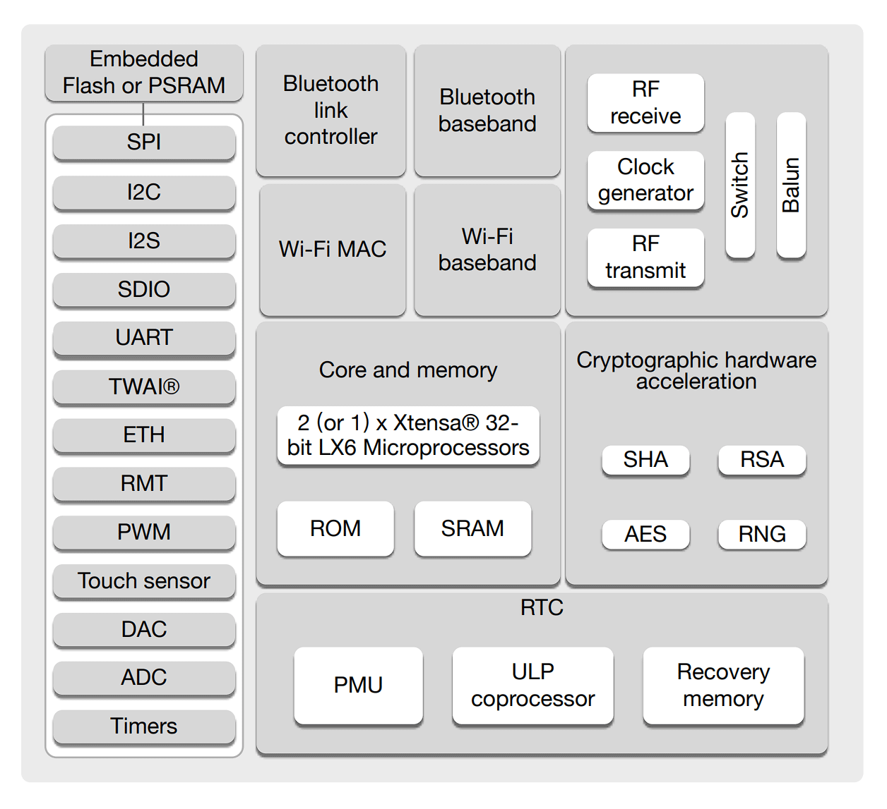
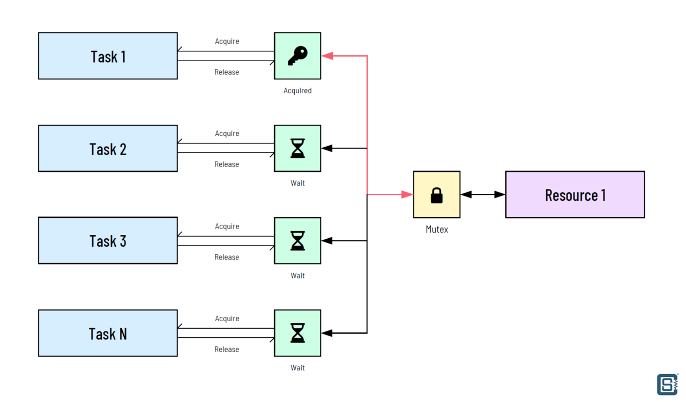
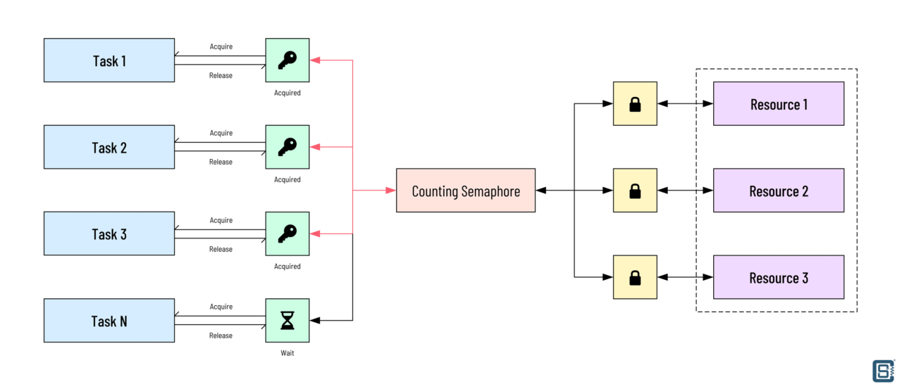

## [ESP32_Mutex 5.3.1 - как писать параллельные многозадачные приложения для ESP32 с использованием FreeRTOS в среде Arduino](https://www.circuitstate.com/tutorials/how-to-write-parallel-multitasking-applications-for-esp32-using-freertos-arduino/)

ESP32 - это автономная электронная плата на двух процессорах от Espressif, выполняющая функции целого устройства (контроллера - SoC) и размещённая на одной интегральной схеме с установленной многозадачной операционной системой FreeRTOS. 

ESP32 — это двухъядерный SoC с высокой тактовой частотой и большим объёмом памяти. Чтобы в полной мере воспользоваться этими возможностями, обычного метода последовательного программирования недостаточно. 

> Последовательное программирование или выполнение — это когда одна задача выполняется, а все остальные задачи ожидают завершения выполняемой задачи.

Последовательное программирование может обеспечить  выполнение нескольких задач одновременно, как если бы каждая задача выполнялась параллельно и независимо друг от друга, если все происходит достаточно быстро, но есть реальные преимущества в использовании «истинного параллелизма» с несколькими ядрами. 

В ESP32 в среде Arduino можно писать настоящие параллельные приложения благодаря отличной поддержке инженеров Espressif. 

### Написание параллельных задач

В базовой программе Arduino есть как минимум две функции или задачи: setup() и loop(). Эти функции представляют собой две логические конструкции, которые помогают нам реализовать логику нашей прикладной программы. Функция setup() запускается только один раз после включения питания и инициализирует все необходимые нам контакты и интерфейсы. Функция loop() с другой стороны может содержать последовательность инструкций, которая будет перезапускаться после завершения итерации/цикла. 

Добавить новую задачу, которая будет выполняться параллельно с другими задачами во FreeRTOS, очень просто. 

В следующем примере запускаются две задачи, которые работают одновременно во внутренней операционной системе FreeRTOS для ESP32. Первая задача мигает контрольным светодиодом, а вторая выводит в последовательный порт традиционный текст "Всем привет!".

Первая задача - это обычный цикл loop() в Ардуино. Вторая задача - это функция loop2(), которая имеет единственный вызываемый аргумент, ***void*** * ***pvParameters***, который мы нигде внутри функции не используем. Эта часть аргумента обязательна для любой функции, которая будет выполняться как задача. Параметр представляет собой тип void указателя с именем pvParameters. Это название не обязательно должно быть таким, оно может быть любым. Но для наглядности оставьте название как есть. Тип возвращаемого значения функции задачи всегда должен быть void. В противном случае это приведет к ошибке компиляции. У задачи  loop() по умолчанию нет никаких аргументов, так как она автоматически инкапсулируется препроцессором (приложением, которое сканирует и перестраивает ваш код) перед его компиляцией.

Следует также отметить наличие цикла while внутри loop2(). Когда мы преобразуем функцию в задачу, мы просим операционную систему только запустить её, а не выполнять многократно. Поэтому нам нужен бесконечный цикл внутри функции loop2(). Без цикла while задача loop2() будет выполнена только один раз, а затем выполнит перезагрузку контроллера. 

Причина, по которой loop() по умолчанию не содержит такого цикла, заключается в том, что среда Arduino уже управляет им.

### [Базовый пример параллельной работы двух задач в ESP32 board 5.1.33  (на контроллере AI-Thinker ESP32-CAM)](ex5-1-33_twousoneBlink/ex5-1-33_twousoneBlink.ino)

### Какое ядро использовать?

Поскольку у Esp32 есть два ядра, то возникает вопрос, какое ядро, как используется и для каких задач.  По умолчанию - код Arduino работает на ядре 1, а функции Wi-Fi и радиочастот (обычно скрытые в среде Arduino) используют ядро 0. Чтобы узнать, на каком ядре выполняется ваша текущая задача, вы можете использовать функцию ***xPortGetCoreID()***. При этом будет выведен идентификатор ядра, на котором выполняются текущая функция. 

```
#define LED_BUILTIN 33
// the setup function runs once when you press reset 
// or power the board
void setup() 
{
  // initialize digital pin LED_BUILTIN as an output.
  pinMode (LED_BUILTIN, OUTPUT);

  Serial.begin (115200);

  xTaskCreatePinnedToCore (
    loop2,     // Function to implement the task
    "loop2",   // Name of the task
    1000,      // Stack size in words
    NULL,      // Task input parameter
    0,         // Priority of the task
    NULL,      // Task handle.
    0          // Core where the task should run
  );
}

// the loop function runs over and over again forever
void loop() 
{
  digitalWrite (LED_BUILTIN, HIGH); // turn the LED on (HIGH is the voltage level)
  delay (1000);                     // wait for a second
  digitalWrite (LED_BUILTIN, LOW);  // turn the LED off by making the voltage LOW
  delay (1000);                     // wait for a second
  Serial.print ("loop() running in core ");
  Serial.println (xPortGetCoreID());
}

// the loop2 function also runs forver but as a parallel task
void loop2 (void* pvParameters) 
{
  while (1) {
    Serial.print ("Hello");
    delay (500); // wait for half a second
    Serial.print (" World from loop2() at ");
    Serial.println (xPortGetCoreID());
    delay (500); // wait for half a second
  }
}
```
Решение о том, какое ядро использовать, зависит от того, какая часть рабочей нагрузки выполняется на этом ядре. Для работы с радиочастотами на ESP32 SoC требуется программное обеспечение, чувствительное ко времени и основанное на прерываниях, которое может быть сложным. Поскольку ядро 0 уже используется для этих задач, всегда лучше использовать второе ядро 1. Но это применимо только в том случае, если вы используете некоторые функции радиочастот, такие как Wi-Fi или BLE. Если вам не нужны какие-либо функции, выберите те ядра, которые вам нравятся.

В приведенном примере можно попробовать изменить ядро с loop2() на 1 . Это позволит loop() и loop2() работать на одном ядре. 

### Совместное использование ресурсов



Внутренняя блок-схема SoC ESP32 показывает, что имеются два (или 1 для некоторых вариантов) 32-разрядных микропроцессорных ядра Xtensa LX6 внутри SoC. Но все остальные ресурсы являются общими. Например, оба ядра используют одно и то же пространство ROM и SRAM. Это также верно для других периферийных устройств. Оба ядра могут обращаться к любым периферийным устройствам, к которым захотят. Но если это так, то не возникнут ли конфликты, если одно ядро попытается выполнить какую-то операцию с одним периферийным устройством, а другое ядро попытается сделать что-то еще с тем же самым? 

Да, такая ситуация может возникнуть в многоядерной среде. По этой причине разработчик кода несёт ответственность за написание бесконфликтного кода при разработке приложений, требующих параллельных задач, выполняемых на нескольких ядрах. Существует достаточно инструментов и методик, которые помогут вам написать чистый и эффективный код для ваших многозадачных приложений.

Одним из примеров конфликта при совместном использовании ресурсов в многоядерной среде является состояние гонки, возникающее при доступе к памяти. Предположим, у нас есть ячейка памяти с адресом 0xF00. Мы можем написать две параллельные задачи; обе они будут пытаться записать случайное число в это место и прочитать его позже. Что-же происходит, когда одна задача записывает значение, а в то же время другая задача пытается сделать то же самое? Какая задача получает возможность записи в ячейку памяти? Ответ не определен. Это означает, что мы не можем предсказать, какая из задач сделает запись в ячейку памяти.

Условия гонки приводят к появлению странных ошибок, которые могут не обнаруживаться при обычном тестировании. Поэтому всякий раз, когда вам нужно разделить переменную, объект, функцию или периферийное устройство между задачами, убедитесь, что только одна задача обращается к ресурсу одновременно. 

Кроме этого задача доступа должна оставить ресурс в определенном состоянии после выполнения операции. 

### Синхронизация задач мьютексом

Всякий раз, когда нам нужно поделиться ресурсом или заставить две задачи взаимодействовать друг с другом, нам нужен механизм, предотвращающий одновременный доступ обеих задач к ресурсу и его изменение. 

Когда задача обращается к ресурсу, нам нужно сообщить всем другим задачам, что ресурс используется в данный момент. Это называется синхронизацией задач. Для достижения этой цели есть два метода: мьютекс и семафор. 

Мьютекс расшифровывается как “взаимное исключение”, это просто общая переменная, доступ к которой всегда осуществляется с помощью атомарных операций. 

> ***Атомарная операция - это способ выполнения последовательности инструкций без каких-либо прерываний до завершения всей последовательности ***

Переменная мьютекса может оставаться в двух состояниях: заблокирована и разблокирована (0 или 1). Можно рассматривать её, как логическую переменную. Она используется для защиты общего ресурса от одновременного доступа к нему нескольких задач. 

Задача может получить блокировку мьютекса, вызвав функцию с именем acquire(). После получения блокировки задача может продолжить работу с объектом, защищенным мьютексом, не беспокоясь о том, что другие задачи изменят ресурс. Если какие-либо другие задачи попытаются получить блокировку мьютекса, когда он уже заблокирован, то они перейдут в состояние ожидания, называемое занятым ожиданием. Процессы, пытающиеся получить блокировку, будут многократно пытаться получить ее, пока не добьются успеха. Занятое ожидание также называется спин-блокировкой.



Задача, которая изначально получила блокировку, освободит её, когда завершит все свои операции. Освободить блокировку мьютекса можно с помощью release(). Теперь другие задачи, ожидающие получения блокировки, могут получить её с помощью acquire(). Acquire() и release() - это общие названия функций, используемые для объяснения концепции, а фактические названия могут зависеть от платформы.

### [МЬЮТЕКС: основной цикл мигает контрольным светодиодом, а две другие задачи делят между собой с помощью мьютекса счетчик и последовательный порт](ex5-1-33_twousoneMutex/ex5-1-33_twousoneMutex.ino)

### Синхронизация задач семафором

Другой тип синхронизации задач называется семафором и представляет собой метод передачи сигналов. Разница между семафором и мьютексом заключается в том, что семафор действует как сигнал, например, световая индикация, а мьютекс — это блокировка, аналогичная навесному замку с ключом. 

Семафор также является переменной, совместно используемой задачами. Но в отличие от мьютексов, он может находиться в более чем двух состояниях. Семафоры реализуются двумя способами: счётные семафоры и двоичные семафоры. 

Семафор-счётчик — это целочисленная переменная, значение которой инициализируется количеством экземпляров определённого ресурса, доступ к которому осуществляется совместно. Например, если у вас есть 10 экземпляров структуры данных, то семафор инициализируется значением 10. Это означает, что все 10 структур в начале свободны. 

Затем задача может запросить один экземпляр этих данных и уменьшить значение переменной семафора. Значение семафора станет равным 9. Когда все экземпляры заняты задачами, семафор становится равным 0. Когда задача завершает использование ресурса, она может освободить ресурс и увеличить семафор на 1. Если задача запрашивает доступ, когда семафор равен 0, она может либо подождать, пока не освободится хотя бы один ресурс, либо выполнить некоторые другие операции, не тратя время на ожидание.



Двоичный семафор, как следует из названия, может принимать только одно значение или находиться в одном из двух состояний (0 и 1). Разница между двоичным семафором и мьютексом заключается в том, что двоичный семафор служит только для передачи сигнала о том, используется ресурс или нет, а мьютекс блокирует ресурс для других задач. Оба варианта имеют разные области применения. 

Концепции мьютекса и семафора:

```
Мьютекс — это блокировка взаимного исключения, которая используется, когда несколько задач конкурируют за один ресурс.

Мьютекс может находиться только в двух состояниях: заблокирован и разблокирован.

Мьютекс заставляет запрашивающие задачи “вращаться” - опрашивать мьютекс и ждать до тех пор, пока не будет доступен ресурс.

Семафор — это метод передачи сигналов. Задачи могут свободно заниматься чем-то другим, не тратя время на ожидание.

Семафоры могут находиться в N состояниях, максимальное значение указывает на общее количество доступных ресурсов.

Семафоры отслеживают использование ресурсов и хорошо подходят для данных, которые можно разделить или использовать в нескольких экземплярах.

Семафор не предоставляет исключительный доступ к ресурсу, а вместо этого предоставляет доступ к одному из множества экземпляров ресурса.

Двоичный семафор указывает на доступность только одного экземпляра ресурса.
```

### [Двоичный семафор: основной цикл мигает контрольным светодиодом, а две другие задачи делят между собой с помощью мьютекса счетчик и последовательный порт](ex5-1-33_twousoneMutex/ex5-1-33_twousoneMutex.ino)

### Критические секции FreeRTOS

Ход исполнения любых последовательных или параллельных задач, которые крутятся в контроллере всегда может быть остановлен для обработки прерывания. После обработки прерывания ситуация внутри прерванной задачи может измениться, что повлечет за собой неправильное исполнение дальнейшего кода в задаче. 

Для решения этой проблемы, FreeRTOS позволяет нам определять критически важные фрагменты кода с помощью макросов taskENTER_CRITICAL() и taskEXIT_CRITICAL(), которые все-таки не прерываются при возникновении прерывания и выполняются полностью. 

> Для критических фрагментов кода действует тоже правило, что и для программ обработки прерывания - фрагмент кода должен быть максимально коротким, вся аналитическая обработка должна быть вынесена во вне. 

Вызов ***taskENTER_CRITICAL()*** должен осуществляться непосредственно перед критически важным фрагментом кода, а ***taskEXIT_CRITICAL()*** после его выполнения. Ещё раз: следует всегда следить за тем, чтобы код критического раздела был как можно короче. В противном случае это негативно скажется на времени отклика на прерывание.


### Библиография

#### [Использование семафоров и мьютексов в FreeRTOS на Arduino Uno](https://microkontroller.ru/arduino-projects/ispolzovanie-semaforov-i-myuteksov-v-freertos-na-arduino-uno/)

В данной статье пример управления семафором из прерывания.

###### [в начало](#kvizzy)

0

1

2

3

4

5

6

7

8

9

0

1

2

3

4

5


