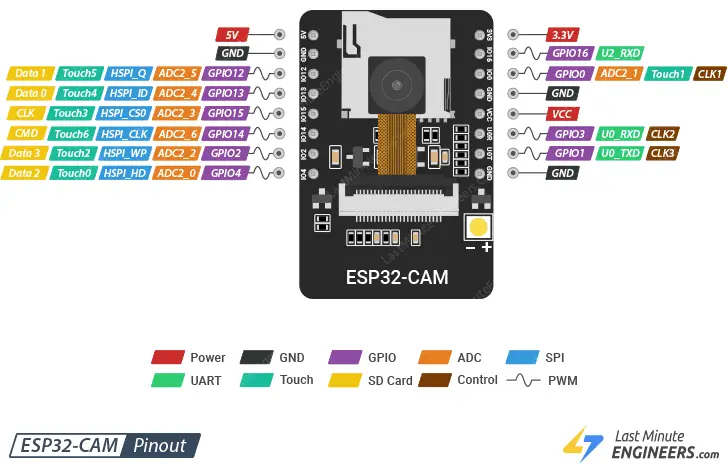

## [Kvizzy30 - Стремящееся к умному хозяйство](#) 

```
###1###
send Led33: {"tidctrl":1,"nicctrl":"myjoy","led33":[{"tiddev":1,"nicdev":"inLed","status":"inLOW"}]}
shttp: https://doortry.ru/State/?Com={"tidctrl":1,"nicctrl":"myjoy","led33":[{"tiddev":1,"nicdev":"inLed","status":"inLOW"}]}***
getCore0: {"Core0":[{"minstack":34}]}
###0###
getCore1: {"core1":[{"iddev":1,"minstack":34}]}
send Led33: {"tidctrl":1,"nicctrl":"myjoy","led33":[{"tiddev":1,"nicdev":"inLed","status":"inHIGH"}]}
shttp: https://doortry.ru/State/?Com={"tidctrl":1,"nicctrl":"myjoy","led33":[{"tiddev":1,"nicdev":"inLed","status":"inHIGH"}]}***
getCore0: {"Core0":[{"minstack":34}]}
###1###
send Led33: {"tidctrl":1,"nicctrl":"myjoy","led33":[{"tiddev":1,"nicdev":"inLed","status":"inLOW"}]}
shttp: https://doortry.ru/State/?Com={"tidctrl":1,"nicctrl":"myjoy","led33":[{"tiddev":1,"nicdev":"inLed","status":"inLOW"}]}***
getCore1: {"core1":[{"iddev":1,"minstack":34}]}

```


### [ESP32-CAM - справочник по распиновке](https://lastminuteengineers.com/esp32-cam-pinout-reference/)



Контакты ADC2 используются драйвером Wi-Fi внутри устройства, они не могут использоваться при включенном Wi-Fi.


Плата имеет 10 каналов (все выводы GPIO) ШИМ-выводов, управляемых ШИМ-контроллером. ШИМ-выход может использоваться для управления цифровыми двигателями и светодиодами.


ШИМ-контроллер состоит из ШИМ-таймеров, ШИМ-оператора и специального подмодуля захвата. Каждый таймер обеспечивает синхронизацию в синхронной или независимой форме, и каждый оператор PWM генерирует форму сигнала для одного канала PWM. Специальный вспомогательный модуль захвата может точно фиксировать события с внешней синхронизацией.

>***Есть два вывода питания: 5V и 3V3. Питание ESP32-CAM может осуществляться через выводы 3,3 В или 5 В. Поскольку многие пользователи сообщают о проблемах при подаче питания на устройство напряжением 3,3 В, рекомендуется, чтобы питание ESP32-CAM всегда подавалось через вывод 5 В.***
> 
> ***Вывод VCC обычно выдает 3,3 В от встроенного регулятора напряжения.***

### [PHP генерация XML-файла - SimpleXML, DOM, метод чтения / записи](https://way2tutorial.com/xml/php-generate-xml.php)

### [ESP32 Arduino: синтаксический анализ XML](https://techtutorialsx.com/2019/11/20/esp32-arduino-parsing-xml/)

### [How to parser XML with TinyXML2 C++](https://terminalroot.com/how-to-parser-xml-with-tinyxml2-cpp/)

Синтаксический анализ XML с помощью ESP32, используя ядро Arduino, как вариант, выполняется с помощью [tinyxml2: https://github.com/leethomason/tinyxml2](https://github.com/leethomason/tinyxml2) - библиотеки синтаксического анализа C++. 

Страница документации  к библиотеке [размещена здесь: https://leethomason.github.io/tinyxml2/index.html](https://leethomason.github.io/tinyxml2/index.html).

Для подключения библиотеки следует сделать следующее: в папке libraries создать новую папку с именем ***tinyxml2***. После этого перейти на страницу библиотеки GitHub и загрузить файлы ***tinyxml2.cpp*** и ***tinyxml2.h*** в только что созданную папку tinyxml2.

Пример работы с библиотекой ***tinyxml2***:

```
#include <tinyxml2.h>
using namespace tinyxml2;
char * testDocument = "<root><element>7</element></root>";

void setup() 
{
   Serial.begin(115200);
   XMLDocument xmlDocument;
   if(xmlDocument.Parse(testDocument)!= XML_SUCCESS)
   {
      Serial.println("Error parsing");
      return; 
   };

   XMLNode * root = xmlDocument.FirstChild();
   XMLElement * element = root->FirstChildElement("element");

   int val;
   element->QueryIntText(&val);
  
   Serial.println(val);
}

void loop() {}
```


### Библиография

###### [в начало](#kvizzy)

0

1

2

3

4

5

6

7

8

9

0

1

2

3

4

5


