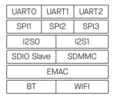

## [Все про память Esp32](#)

ESP32 представляет собой двухъядерную систему с двумя процессорами Xtensa LX6 гарвардской архитектуры. Вся встроенная память, внешняя память и периферийные устройства расположены на шине данных и шине команд этих процессоров.

За некоторыми незначительными исключениями, отображение адресов двух процессоров симметрично, что означает, что они используют одни и те же адреса для доступа к одной и той же памяти. 

Некоторые периферийные устройства также напрямую (через DMA-Direct Memory Access) могут обращаться к встроенной памяти.

#### *Адресное пространство:*

- cимметричное отображение адресов;
- доступ к некоторым областям встроенной и внешней памяти возможен как по шине данных так и по шине команд;
- 4 ГБ (32-разрядного) адресного пространства как для шины данных, так и для шины команд;
- 1296 КБ адресного пространства встроенной памяти;
- 19704 КБ адресного пространства внешней памяти;
- 512 КБ адресного пространства периферийных устройств;
- 328 КБ адресного пространства DMA

#### *Встроенная память:*

- 448 КБ встроенного ПЗУ (ROM - энергонезависимой постоянной памяти);
- 520 КБ встроенной оперативной памяти для данных и инструкций (SRAM);
- 8 КБ быстрой оперативной памяти RTC (Real-Time Clock FAST Memory);
- 8 КБ медленной оперативной памяти RTC (Real-Time Clock SLOW Memory)

Внутреннее ПЗУ разделено на две части: Internal ROM0 (384 КБ) и Internal ROM1 (64 КБ).

Внутренняя оперативная память разделена на три части: Internal SRAM0  (192 КБ), Internal SRAM1 (128 КБ) и Internal SRAM2 (200 Кбайт).

RTC FAST Memory может использоваться для хранения данных, к ней обращается основной процессор во время загрузки RTC из режима глубокого сна. 

RTC SLOW Memory доступна только сопроцессору ULP в режиме глубокого сна. Сопроцессор ULP (ultra-low-power processor - процессор со сверхнизким потреблением) остаётся в работе в режиме пониженного энергопотреблении Deep Sleep. В данном режиме основные два ядра контроллера не работают. 

#### *Внешняя память (Flash)*

разбивается на разделы и может использоваться с различными назначениями:

- поддерживается до 16 МБ файловой системы для хранения больших данных в виде файлов (например SPIFFS - SPI Flash File Storage);
- поддерживается до 8 МБ SPI SRAM, как оперативной памяти для данных и инструкций.

Внешняя память может быть использовано контроллером, как доступное адресное пространство, вместо встроенной памяти. В этом случае часть встроенной памяти становится кэшем для внешней памяти.

#### *Периферийные устройства*

- 41 периферийное устройство

#### *DMA*

- 13 модулей способны работать в режиме DMA

#### *Внутреннее ПЗУ0 - Internal ROM0*

Объем внутреннего ПЗУ0 составляет 384 КБ. Доступ к нему осуществляется обоими процессорами через диапазон адресов 0x4000_0000 - 0x4005_FFFF, который находится на шине команд.

Диапазон адресов первых 32 КБ ПЗУ0 (0x4000_0000 - 0x4000_7FFF) может быть переназначен для доступа к части внутренней памяти SRAM1, которая обычно находится в диапазоне памяти 0x400B_0000 - 0x400B_7FFF.

При переназначении 32-килобайтная SRAM-память больше не может быть доступна с диапазоном адресов 0x400B_0000 - 0x400B_7FFF, но она все еще может быть доступна через шину данных 0x3FFE_8000 - 0x3FFE_FFFF.

Это можно сделать для каждого процессора: установка бита 0 в регистре DPORT_PRO_BOOT_REMAP_CTRL_REG или DPORT_APP_BOOT_REMAP_CTRL_REG приведет к переназначению SRAM для PRO_CPU и APP_CPU соответственно.

#### *Внутреннее ПЗУ1 - Internal ROM1* 

Емкость внутреннего ПЗУ1 составляет 64 КБ. Оно может быть прочитано любым процессором в диапазоне адресов 0x3FF9_0000 - 0x3FF9_FFFF шины данных.

#### *Внутренняя оперативная память SRAM0*

Емкость внутренней памяти SRAM0 составляет 192 КБ. Аппаратное обеспечение может быть настроено таким образом, чтобы использовать первые 64 КБ для кэширования доступа к внешней памяти. Когда они не используются в качестве кэша, первые 64 КБАЙТ могут быть считаны и записаны любым процессором по адресам 0x4007_0000 - 0x4007_FFFF шины команд. 

Оставшиеся 128 КБАЙТ всегда могут быть считаны и записаны
любым процессором по адресам 0x4008_0000 - 0x4009_FFFF шины команд.

#### *Внутренняя память SRAM1*

Емкость внутренней памяти SRAM1 составляет 128 КБАЙТ. Любой центральный процессор может считывать и записывать данные из этой памяти по адресам 0x3FFE_0000 - 0x3FFF_FFFF шины данных, а также по адресам 0x400A_0000 - 0x400B_FFFF шины команд.

Доступ к диапазону адресов по шине команд осуществляется в обратном порядке (по словам) по сравнению с доступом по шине данных. 

То есть, адреса:
```
0x3FFE_0000 и 0x400B_FFFC обращаются к одному и тому же слову
0x3FFE_0004 и 0x400B_FFF8 используют одно и то же слово
0x3FFE_0008 и 0x400B_FFF4 используют одно и то же слово
……
0x3FFF_FFF4 и 0x400A_0008 обращаются к одному и тому же слову
0x3FFF_FFF8 и 0x400A_0004 используют одно и то же слово
0x3FFF_FFFC и 0x400A_0000 используют одно и то же слово
```
Как шина данных, так и шина команд центрального процессора по-прежнему имеют начальный порядок байтов, поэтому порядок байтов отдельных слов
в адресных пространствах не меняется на противоположный. 

Например, адреса:

```
0x3FFE_0000 обращается к младшему значащему байту в слове, к которому обращается 0x400B_FFFC;
0x3FFE_0001 обращается ко второму по старшинству байту в слове, к которому обращается 0x400B_FFFC;
0x3FFE_0002 обращается ко второму по старшинству байту в слове, к которому обращается 0x400B_FFFC;
0x3FFE_0003 обращается к старшему значащему байту в слове, к которому обращается 0x400B_FFFC.

0x3FFE_0004 обращается к младшему значащему байту в слове, к которому обращается 0x400B_FFF8;
0x3FFE_0005 обращается ко второму по старшинству байту в слове, к которому обращается 0x400B_FFF8;
0x3FFE_0006 обращается ко второму по старшинству байту в слове, к которому обращается 0x400B_FFF8;
0x3FFE_0007 обращается к старшему значащему байту в слове, к которому обращается 0x400B_FFF8.
```
Часть этой памяти может быть переназначена в адресное пространство ROM0. 

#### *Внутренняя память SRAM2*

Емкость внутренней памяти SRAM2 составляет 200 КБАЙТ. Она может считываться и записываться любым процессором по адресам 0x3FFA_E000 - 0x3FFD_FFFF на шине данных.

#### *DMA*

DMA в ESP32 - это контроллер прямого доступа к памяти (***Direct Memory Access***). Он позволяет некоторым периферийным устройствам (UART, SPI, I2C, Ethernet и другим) работать с ОЗУ напрямую, то есть без участия процессора. Это помогает разгрузить процессор и ускорить процесс обмена данными между памятью и периферией, поэтому в ряде случаев грамотное использование DMA позволяет существенно увеличить скорость работы программы. 

DMA использует ту же адресацию, что и шина данных центрального процессора:  для чтения и записи во внутреннюю SRAM1 0x3FFE_0000 - 0x3FFF_FFFF, для чтения и записи во внутреннюю SRAM2 0x3FFA_E000 - 0x3FFD_FFFF.

В микроконтроллерах ESP32 прямой доступ к памяти имеют 13 периферийных устройств:



***[UARTx](#)*** - инструменты последовательной связи для обмена данными между двумя устройствами по протоколу UART (Universal Asynchronous Receiver-Transmitter).

В отличие от SPI или I2C, которые являются синхронными, UART является асинхронным, то есть он не использует тактовый сигнал для синхронизации передачи данных между устройствами. Однако оба устройства должны согласовывать скорость передачи данных (baud).

В UART-коммуникации данные передаются последовательно, побитно, с заранее определённой скоростью (битами в секунду). Для передачи данных используется одна линия (TX), а для приёма — другая (RX).

UART-порты позволяют обмениваться данными с другими устройствами, такими как другие микроконтроллеры, компьютер, датчики, GPS или Bluetooth-модули, некоторые типы дисплеев и другие.

***[SPIx](#)***. SPI (последовательный периферийный интерфейс) - это протокол шины, который позволяет ESP32 взаимодействовать с периферийными устройствами или интегральными схемами, соответствующими протоколу SPI.

В рамках протокола одно устройство (обычно ESP32) действует как «ведущий» шины, а все остальные устройства — как «ведомые». Это означает, что одновременно происходит связь между ведущим и одним отдельным подчиненным. Подчиненные устройства не общаются друг с другом.

Назначение шины состоит в том, что можно подключить несколько устройств к ESP32 (ведущему устройству), используя минимум проводов.

***[I2Sx](#)***. I2S - это синхронный последовательный протокол связи, используемый для передачи цифровых аудиоданных между устройствами. Он предназначен для связи между микрофонами, аудиосенсорами, цифровыми и аналоговыми преобразователями и другими аудиоперифериями.

Протокол I2S использует три основные линии: 

- Serial Clock (SCK). Эта линия обеспечивает главный такт, который синхронизирует передачу битов между устройствами;
- Word Select (WS). Линия такта слова, она указывает, когда начинается новое слово данных (например, новый аудиоканал);
- Data Line (SD). Несёт сами цифровые аудиоданные. 

ESP32 содержит две I2S-периферии, которые можно настроить для ввода и вывода данных по протоколу I2S.


### Библиография

#### [Руководство по программированию ESP-IDF ESPRESSIF 5.3.1](https://docs.espressif.com/projects/esp-idf/en/v5.3.1/esp32/index.html)

#### [ESP32 Техническое справочное руководство версии 5.2](esp32_technical_reference_manual_en.pdf)


###### [в начало](#kvizzy)

0

1

2

3

4

5

6

7

8

9

0

1

2

3

4

5


