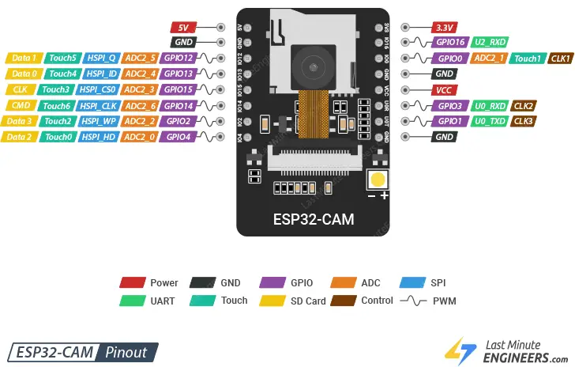

## [Kvizzy44 - исполнительное приложение умного хозяйства  на контроллере Esp32-CAM](#) 

### [Kvizzy44](#) - исполнительное приложение умного хозяйства на контроллере ESP32-CAM для снятия показаний температуры, влажности, давления, освещенности; формирования потока изображений наблюдаемого объекта а также для управления режимом работы вспышки и интервалами передачи http-сообщений от контроллера на сайт 

### [kwinflat.ru](#) - сайт умного хозяйства на контроллере ESP32-CAM для управления светодиодом, снятия показаний температуры, влажности и формирования потока изображений наблюдаемого объекта

---

### [Тезисы прoекта](#%D1%82%D0%B5%D0%B7%D0%B8%D1%81%D1%8B-%D0%BF%D1%80%D0%BE%D0%B5%D0%BA%D1%82%D0%B0)

### [Слoварь](#%D1%81%D0%BB%D0%BE%D0%B2%D0%B0%D1%80%D1%8C)

### [ESP32-CAM - справoчник по распиновке](#esp32-cam---%D1%81%D0%BF%D1%80%D0%B0%D0%B2%D0%BE%D1%87%D0%BD%D0%B8%D0%BA-%D0%BF%D0%BE-%D1%80%D0%B0%D1%81%D0%BF%D0%B8%D0%BD%D0%BE%D0%B2%D0%BA%D0%B5)

### [ArduinоJSON](#arduinojson)

### [XML - генерация файла, синтаксический анализ](#xml---%D0%B3%D0%B5%D0%BD%D0%B5%D1%80%D0%B0%D1%86%D0%B8%D1%8F-%D1%84%D0%B0%D0%B9%D0%BB%D0%B0-%D0%B8-%D1%81%D0%B8%D0%BD%D1%82%D0%B0%D0%BA%D1%81%D0%B8%D1%87%D0%B5%D1%81%D0%BA%D0%B8%D0%B9-%D0%B0%D0%BD%D0%B0%D0%BB%D0%B8%D0%B7)

---

### Тезисы проекта

- Концепция: "Одно знает и показывает сайт, другое видит контроллер". 

- В основе на верхнем уровне (на сайте) две таблицы: State, Lead

```
State:                                Текущее значение     Новое
================================================================

                                             Показания датчиков:
                                             -------------------
датчик температуры (Цельсий)          -10                      5
датчик влажности (процент)             60                     80
датчик давления 
датчик освещенности 

                                           Режим работы вспышки:
                                           ---------------------
процент времени свечения в цикле       10                     17
цикл "горит - не горит" (мсек)       2000                   5000

                      Интервалы подачи сообщений от контроллера:
                      ------------------------------------------
интервал режима работы Led4          7007                  11000
подача изображения (мсек)            1001                   2000
температура и влажность (мсек)       3003                   4000
атмосферное давление (мсек)          5005                   7000
освещённость камеры (мсек)           2002                   4000

Lead:                                    Изменилось/подтверждено  
================================================================
-1 режим работы вспышки                                      1/0
-2 интервалы подачи сообщений от контроллера                 1/0
```

- Контроллер ESP32-CAM может обрабатывать до 32 прерываний на каждое ядро.

- Наибольший приоритет задачи - 25. Основной цикл ***Loop*** имеет приоритет = 1. Прерываниям установлены приоритеты, равные 0 (само собой, событие происходит и запускается обработка прерывания, независимо от приоритета задач).

- В Freertos нет ограничения на количество задач. Имеет место естественное ограничение памятью и другими ресурсами контроллера.

- Управления светодиодом осуществляется через ***GPIO0***, снятия показаний температуры и влажности выполняется по ***GPIO16***.
 
- Режим работы светодиода определяется двумя параметрами: длительность цикла "горит - не горит", процент времени свечения светодиода в цикле.

- Режим работы изменяется по команде со стороны сайта.

- Для контроллера может запускаться тестирование вводом команд через последовательный порт: зацикливание задач, трассировка сообщений от задач, отключение и включение задач.

#### [Задачи:](https://calculat.io/ru/number/prime/1--1000) 

- ***vLoop***, базовый цикл, приоритет 1. ;

- ***vLead***, регулярный (с интервалом 439 мсек) запрос контроллера на изменение состояний его устройств к странице ***Lead***. Приоритет 10.

- ***vState***, выборка из очереди и отправка сообщения от контроллера о состоянии его устройств и показаниях датчиков  (с интервалом 359 мсек) на страницу ***State***. Приоритет 9;

- ***vPrint***, выборка из очереди и вывод сообщений на периферию (в последовательный порт) с интервалом 983 мсек. Приоритет 7;

- ***vStream***, фотографирование наблюдаемого объекта (с интервалом 2971 мсек) и отправка Base64 изображения на страницу Stream. Приоритет 8.

#### Прерывания:

- ***---irqToggleLedWork***, смена состояния (CHANGE) светодиода. При изменении состояния светодиода в очередь ***queState*** отправляется json-строка состояния светодиода;

- ***---irqLightLedFlash***, вспышка - изменение состояния 4 контакта с LOW на HIGH и обратно (CHANGE). Отправка json-строки состояния светодиода в очередь***queState***;

#### Очереди сообщений:

- ***---queState***, очередь состояний устройств и показаний датчиков для отправки на страницу State;

- ***---queMessa***, очередь сообщений на периферию (в последовательный порт);

#### Старт приложения 

- при старте приложения светодиод переводится в режим с длительностью цикла "горит - не горит" равным 2014 секунд и процентом времени свечения светодиода в цикле равным 50. Cообщение об этом передается в очередь ***queState*** и далее на страницу State.

### Словарь

 - ***Деятельность*** - выделенная часть основного цикла приложения, выполняющая  отдельную задачу.

###### [к содержанию](#%D1%82%D0%B5%D0%B7%D0%B8%D1%81%D1%8B-%D0%BF%D1%80o%D0%B5%D0%BA%D1%82%D0%B0)

### [ESP32-CAM - справочник по распиновке](https://lastminuteengineers.com/esp32-cam-pinout-reference/)




###### [к содержанию](#%D1%82%D0%B5%D0%B7%D0%B8%D1%81%D1%8B-%D0%BF%D1%80o%D0%B5%D0%BA%D1%82%D0%B0)

### ArduinoJSON

###### [к содержанию](#%D1%82%D0%B5%D0%B7%D0%B8%D1%81%D1%8B-%D0%BF%D1%80o%D0%B5%D0%BA%D1%82%D0%B0)

### XML - генерация файла и синтаксический анализ

#### [PHP генерация XML-файла - SimpleXML, DOM, метод чтения / записи](https://way2tutorial.com/xml/php-generate-xml.php)

#### [ESP32 Arduino: синтаксический анализ XML](https://techtutorialsx.com/2019/11/20/esp32-arduino-parsing-xml/)

#### [How to parser XML with TinyXML2 C++](https://terminalroot.com/how-to-parser-xml-with-tinyxml2-cpp/)

Синтаксический анализ XML с помощью ESP32, используя ядро Arduino, как вариант, выполняется с помощью [tinyxml2: https://github.com/leethomason/tinyxml2](https://github.com/leethomason/tinyxml2) - библиотеки синтаксического анализа C++. 

Страница документации  к библиотеке [размещена здесь: https://leethomason.github.io/tinyxml2/index.html](https://leethomason.github.io/tinyxml2/index.html).

Для подключения библиотеки следует сделать следующее: в папке libraries создать новую папку с именем ***tinyxml2***. После этого перейти на страницу библиотеки GitHub и загрузить файлы ***tinyxml2.cpp*** и ***tinyxml2.h*** в только что созданную папку tinyxml2.

Пример работы с библиотекой ***tinyxml2***:

```
#include <tinyxml2.h>
using namespace tinyxml2;
char * testDocument = "<root><element>7</element></root>";

void setup() 
{
   Serial.begin(115200);
   XMLDocument xmlDocument;
   if(xmlDocument.Parse(testDocument)!= XML_SUCCESS)
   {
      Serial.println("Error parsing");
      return; 
   };

   XMLNode * root = xmlDocument.FirstChild();
   XMLElement * element = root->FirstChildElement("element");

   int val;
   element->QueryIntText(&val);
  
   Serial.println(val);
}

void loop() {}
```

### Библиография

#### [CameraCar - пример для 4 колес и камеры](https://github.com/un0038998/CameraCar) 

###### [к содержанию](#%D1%82%D0%B5%D0%B7%D0%B8%D1%81%D1%8B-%D0%BF%D1%80o%D0%B5%D0%BA%D1%82%D0%B0)
