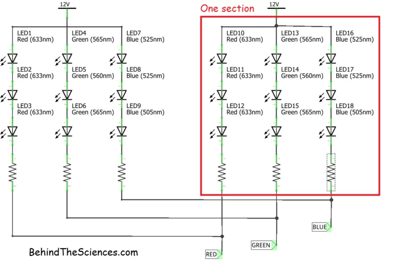
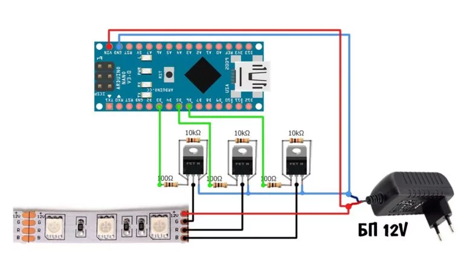
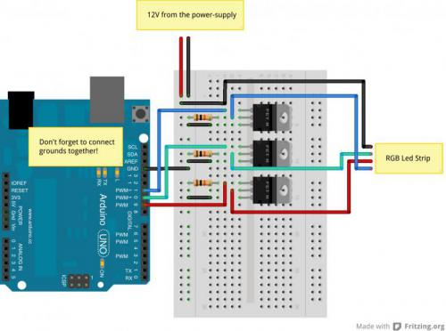
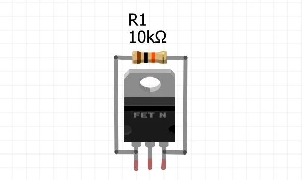
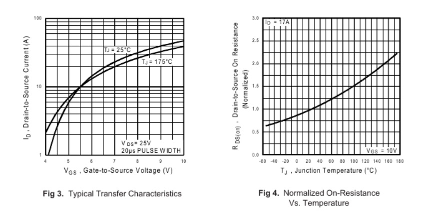
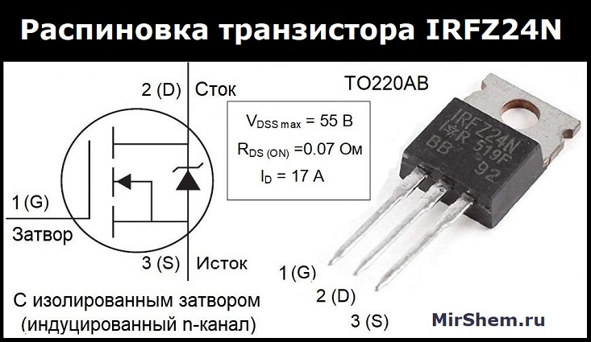
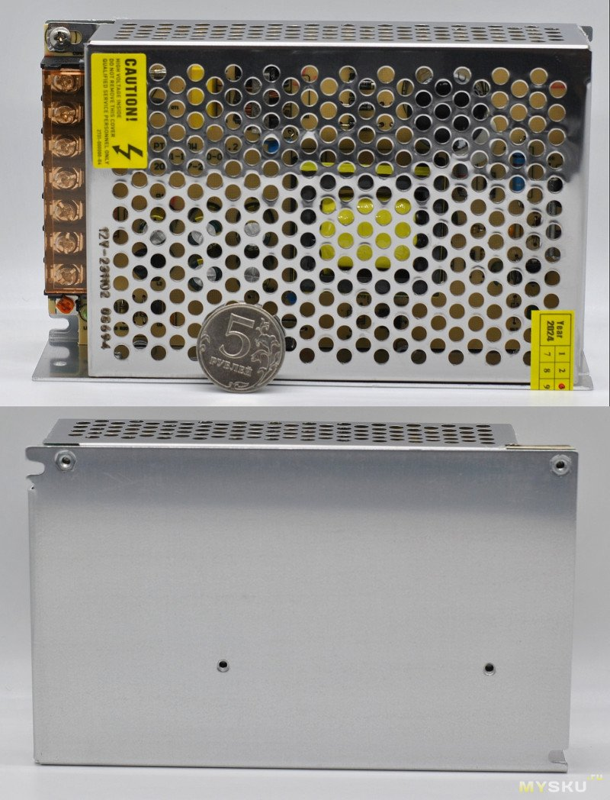
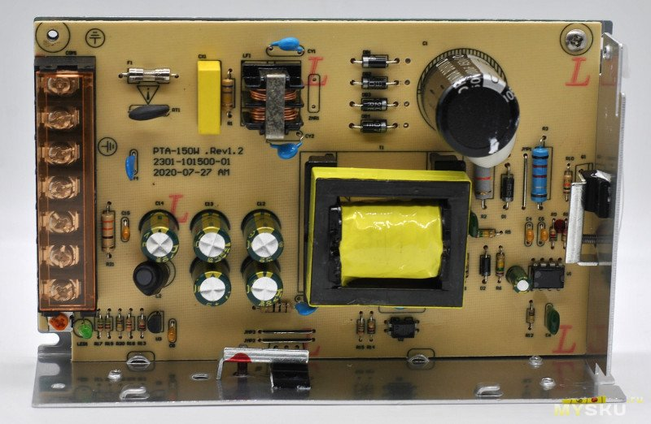
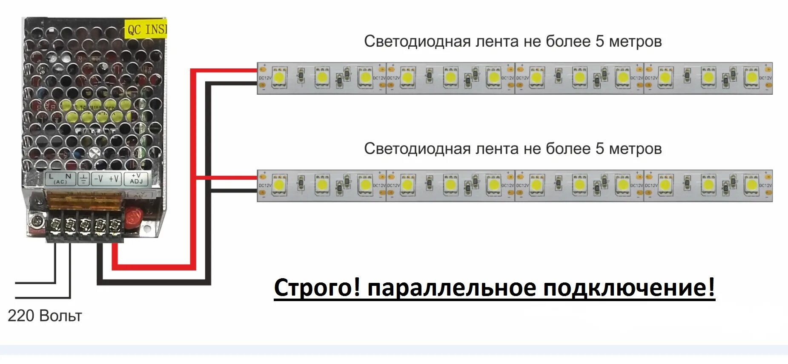
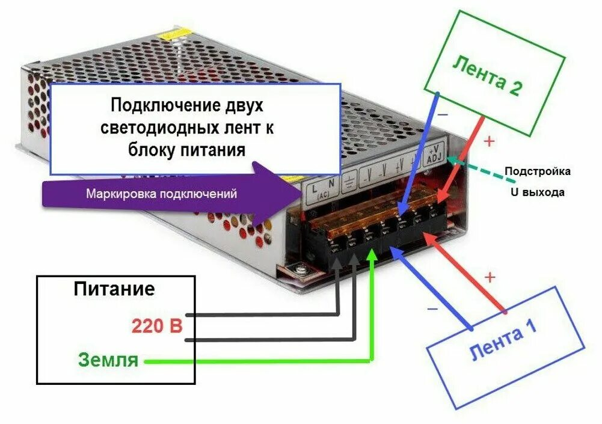

## [LedyEs - вынужденное и познавательное знакомство со светодиодными лентами]() 

Так уж случилось - перестала слушаться лента у натяжного потолка. Тактическая ошибка - контроллер и блок питания за потолком. Пришлось вскрывать потолок. 

Решил разобраться - что это такое светодиодная лента.

RGB светодиодные ленты устроены аналогично RGB светодиодам: в 12 Вольтовой ленте светодиоды каждого цвета соединяются по три штуки с токоограничивающим резистором и образуют сегмент ленты, далее эти сегменты подключаются параллельно.



Также лента имеет общий вывод со всех цветов, в большинстве случаев это общий анод (+), так как в управлении нагрузкой чаще всего используют N-канальные полевые транзисторы, потому что они дешевле, удобнее в применении и имеют более удачные характеристики (драйверы для RGB лент также делают на основе N-канальников).

#### MOSFET

Для подключения RGB светодиодной ленты к Arduino понадобятся три полевых транзистора и резисторы им в обвязку (почему и зачем - читай в [уроке про управление нагрузкой](https://alexgyver.ru/lessons/arduino-load/). Подключается всё вот по такой схеме:





 Если нужно плавное управление яркостью цветов - подключаем к ШИМ пинам, если просто вкл/выкл - можно к обычным.
 
#### [IRFZ24N MOSFET](https://alltransistors.com/ru/mosfet/transistor.php?transistor=3377)

``` 
Наименование прибора: IRFZ24N
Тип транзистора:      MOSFET
Полярность:           N
Тип корпуса:          TO220
Pd      - Максимальная рассеиваемая мощность: 45 W
Vds     - Предельно допустимое напряжение сток-исток: 55 V
Vgs     - Предельно допустимое напряжение затвор-исток: 20 V
Vgs(th) - Пороговое напряжение включения: 4 V
Id      - Максимально допустимый постоянный ток стока: 17 A
Tj      - Максимальная температура канала: 175 °C
Qg      - Общий заряд затвора: 20(max) nC
tr      - Время нарастания: 34 ns
Coss    - Выходная емкость: 140 pf
Rds     - Сопротивление сток-исток открытого транзистора: 0.07 Ohm
```

- Резистор на 100 Ом (можно ставить в диапазоне 100-500 Ом, мощность любая) выполняет защитную функцию: затвор полевика представляет собой конденсатор, в момент открытия затвора конденсатор начнёт заряжаться и в цепи пойдёт большой ток (практически короткое замыкание), который может повредить пин Ардуино. Резистор просто ограничивает ток в цепи пин-затвор и спасает пин от скачков тока. В целом можно его не ставить, но когда-нибудь оно обязательно сломается =)

- Резистор на 10 кОм (можно ставить в диапазоне 5-50 кОм, мощность любая) выполняет подтягивающую функцию для затвора. Если случится так, что плата Ардуино выключена или сигнальный провод от неё отвалился - на затвор будут приходить случайные наводки и он может случайно открыться. Если в этот момент будет подключен источник питания - нагрузка тоже включится!  Подтягивающий к GND резистор позволяет "прижать" затвор, чтобы он не открылся сам по себе. Имеет смысл ставить его прямо на корпус транзистора, если монтаж производится навесом:



#### Как выбрать транзистор для своей задачи? 

Первым делом смотрим на напряжение открытия транзистора, 100% подойдёт транзистор с пометкой Logic Level в описании или даташите: такие мосфеты точно будут работать на полную катушку от пина МК. Само собой ток и напряжение должны соответствовать (взяты с запасом) для нагрузки, которую будет коммутировать мосфет. 

Есть ещё параметр сопротивление открытого канала, на этом сопротивлении будет падать напряжение и превращаться в тепло. Для мощных нагрузок нужно рассматривать полевики с низким сопротивлением канала, чтобы сильно не грелись.



#### [IRFZ24N - datasheet](irfz24n.pdf)



### [S-100-12, импульсный источник питания](https://mysku.club/blog/aliexpress/100348.html)

БП S-100-12 в алюминиевом корпусе с пассивным охлаждением на ходовое напряжение 12 В. Такие блоки используют для питания светодиодных лент, систем видеонаблюдения, станков, автоматизации и пр.



Такие блоки можно монтировать «лежа» и на боковой грани, есть как проушины, так и резьбовые отверстия под М3. Переключателя входного напряжения нет. Пленка-изолятор под платой имеется. Интерфейсы традиционно сосредоточены на клеммной колодке с защитной пластиковой крышкой (3 клеммы для сети и 2 пары на выходное напряжение). Есть переменный резистор для небольшой регулировки выхода.
Измеренная масса блока 310 г.

Снимаем верхнюю крышку:



Текстолит платы 1,6 мм. Сетевой фильтр, варистор и предохранитель на входе имеются. ШИМ контроллер L2263. Силовых элементов на стенках корпуса в качестве радиатора два — оба в пластиковом TO-220-м корпусе (термопаста в наличии). В торце стоит мосфет SIF6N65FB, по длинной стороне шоттки MBRF20100CT. Есть зеленый индикатор работы. Электролит на входе: 100 мкФ 450 В, на выходе сборка 5000 мкФ 16 В.

#### [Схемы подключения:](https://darminaopel.ru/full_img/shema-podkljuchenija-s-100-12/0)





#### [Обозначение L и N в электрике](https://rozetkaonline.ru/stati/oboznachenie-l-i-n-v-elektrike?hl=ru_RU&utm_referrer=https%3A%2F%2Fyandex.ru%2F)

Каждый раз, пытаясь подключить люстру или бра, датчик освещенности или движения, варочную панель или вытяжной вентилятор, терморегулятор теплого пола или блок питания светодиодной ленты, а также любое другое электрооборудование, вы можете увидеть следующие маркировки возле клемм подключения – ***L*** и ***N***.

> «***L***» - Эта маркировка пришла в электрику из английского языка, и образована она от первой буквы слова «Line» (линия) – общепринятого названия фазного провода. Также, если вам удобнее, можно ориентироваться на такие понятия английских слов как Lead (подводящий провод, жила) или Live (под напряжением).
> 

Соответственно обозначением L маркируются зажимы и контактные соединения, предназначенные для подключения фазного провода. В трехфазной сети, буквенно-цифровая идентификация (маркировка) фазных проводников "L1", "L2" и "L3".

По современным стандартам (ГОСТ Р 50462-2009 (МЭК 60446:2007), действующим в России, цвета фазных проводов – коричневый или черный. Но зачастую, может встречаться белый, розовый, серый или провод любого другого цвета, кроме синего, бело-синего, голубого, бело-голубого или желто-зеленого.

> «***N***» - маркировка, образованная от первой буквы слова Neutral (нейтральный) – общепринятое название нулевого рабочего проводника, в России называемого чаще просто нулевым проводником или коротко Ноль (Нуль). В связи с этим, удачно подходит английское слово Null (нулевой), можно ориентироваться на него.
> 

Обозначением N в электрике маркируются зажимы и контактные соединения для подключения нулевого рабочего проводника/нулевого провода. При этом это правило действует как в однофазной, так и трехфазной сети.

Цвета провода, которыми маркируется нулевой провод (нуль, ноль, нулевой рабочий проводник) строго синий (голубой) или бело-синий (бело-голубой).

### [Библиография](#)

#### [RGB светодиоды и ленты](https://alexgyver.ru/lessons/arduino-rgb/)

#### [Управление мощной нагрузкой](https://alexgyver.ru/lessons/arduino-load/)

#### [RGB светодиодная лента](https://cxem.net/beginner/beginner61.php)

#### [Неисправности светодиодных лент и методы их ремонта](https://masterpotoku.ru/full/kak-podklucit-svetodiodnuu-lentu-3-osibki-shema-i-pravila-dla-lent-12-24-volt.html)

#### [Ремонт системы освещения светодиодной RGB лентой](https://ydoma.info/ehlektrotekhnika/lampy-svetilniki-remont/lampy-svetodiodnye-lenty-remont-sistemy-rgb.html)


###### [в начало](#kvizzy)

0

1

2

3

4

5

6

7

8

9

0

1

2

3

4

5


