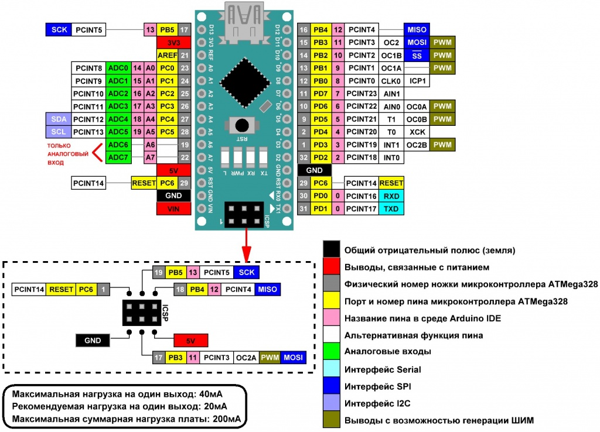

## Arduino Nano и датчики

### [Arduino Nano](https://3drob.ru/stati/pro_arduino/platy_3/arduino_nano)

### [Цифровой термометр DS18B20 (Trema-модуль v2.0)](https://wiki.iarduino.ru/page/cifrovoy-termometr-trema-modul/#h3_2)

### [DS18B20 и ESP32 — Схема подключения и пример кода](https://voltiq.ru/ds18b20-esp32-connection/?ysclid=m9pkcduh62294021169)

###### [к содержанию](#soderzhanie)
