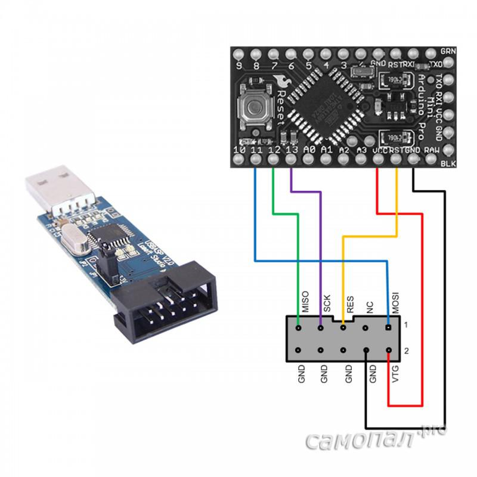
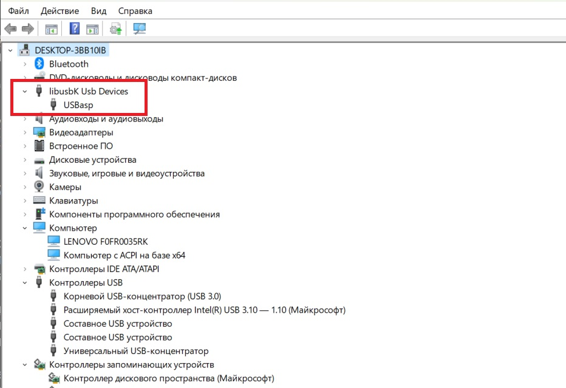
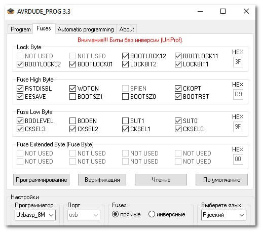
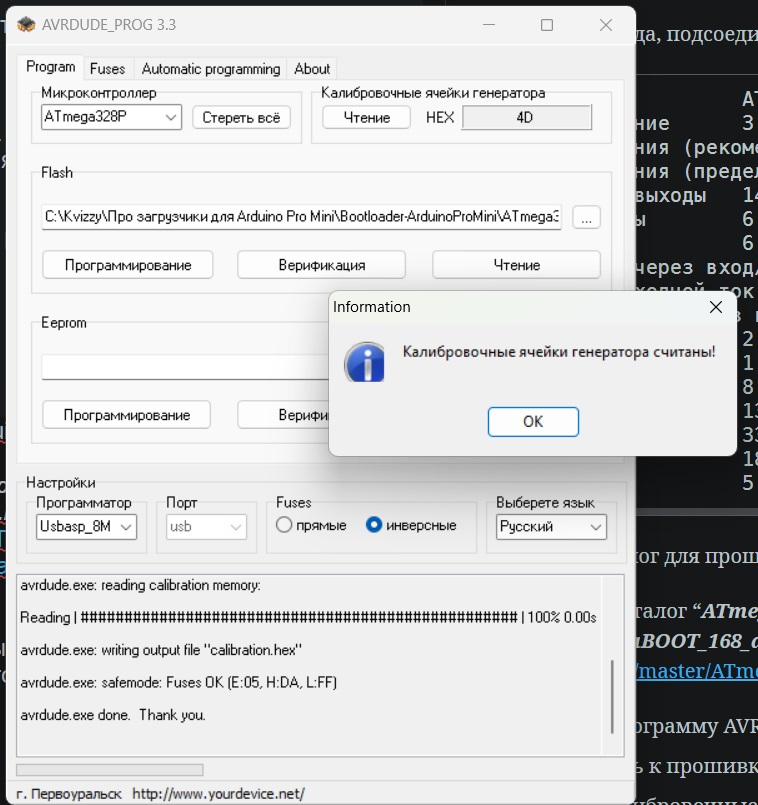
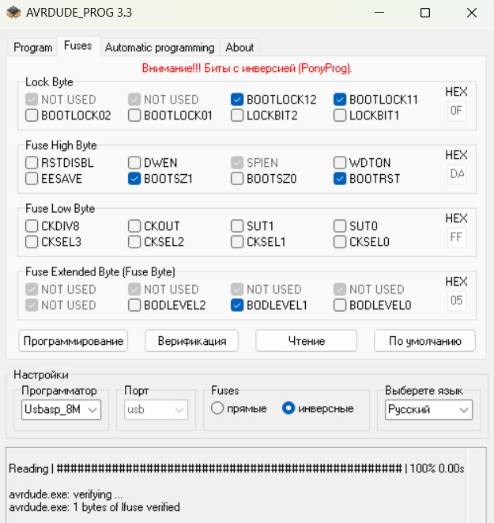

### [Про загрузчики для Arduino Pro Mini]()

Поисковые запросы:

"сторожевой таймер ардуино",

"исходники стандартного загрузчика ардуино".

> [ArduinoIDE содержит все исходники загрузчиков и тулчейн для компиляции.
> Папка hardware](https://arduino.ru/forum/programmirovanie/tekst-programmy-zagruzchika).
> 

#### [Программатор USB в алюминиевом корпусе USBASP USBISP AVR, USB ISP USB ASP ATMEGA8 ATMEGA128, поддержка Win7 64 (случайный цвет)](https://aliexpress.ru/item/1005001621886173.html?spm=a2g2w.orderdetail.0.0.7b054aa6W7Qksy&sku_id=12000020040993383)

Куплен на AliExpress, получен 24 июля 2023, 168 ₽.

Этот программатор основан на технологии USBasp Томаса Фишла и подключается к USB-порту вашего компьютера. Он не только довольно компактный, но и отличается элегантным дизайном. Интерфейс USB реализован с помощью процессора atmega, а все остальное реализовано встроенным ПО. Для тех, кто заинтересован, исходный код прошивки можно загрузить с веб-сайта USBasp.

Поддержка AVRDude начиная с версии 5.2

Позволяет считывать или записывать EEPROM микроконтроллера, встроенное ПО, биты предохранителей и блокировки.

Support for Linux, OS X and Windows (will work on vista)

Максимальная скорость записи 5 КБИТ/сек

Программно управляемая опция SCK для поддержки плат с низкой тактовой частотой (< 1,5 МГц)

10 pin ISP interface

Эти программаторы являются идеальным дополнением к 28-контактной плате разработки Protostack AVR или набору для разработки Protostack ATMEGA8.

Supported microcontrollers include:

Mega Series

ATmega8 ATmega48 ATmega88 ATmega168 ATmega328

ATmega103 ATmega128 ATmega1280 ATmega1281 ATmega16

ATmega161 ATmega162 ATmega163 ATmega164 ATmega169

ATmega2560 ATmega2561 ATmega32 ATmega324 ATmega329

ATmega3290 ATmega64 ATmega640 ATmega644 ATmega649

ATmega6490 ATmega8515 ATmega8535

Tiny Series

ATtiny12 ATtiny13 ATtiny15 ATtiny25 ATtiny26

ATtiny45 ATtiny85 ATtiny2313

Classic Series

AT90S1200 AT90S2313 AT90S2333 AT90S2343 AT90S4414

AT90S4433 AT90S4434 AT90S8515

AT90S8535
CAN Series
AT90CAN128
PWM Series
AT90PWM2 AT90PWM3.

Размер печатной платы: 35 (мм) x 20 (мм)/ 1,37 "x 0,78"

Преобразователь интерфейса ISP можно использовать ДЛЯ платы разработки Arduino.

Для загрузки преобразователя интерфейса можно использовать плату разработки AVR MCU.

Стандартный интерфейс программатора AVRISP USBASP STK500 преобразуется в стандартный 6-контактный из 10-контактного интерфейса преобразователя

#### Доверенные магазины AliExpress

1. Estardyn Official Store

### Библиография

#### [Bootloader on Arduino boards](https://docs.arduino.cc/retired/hacking/software/Bootloader/)

#### [Arduino AVR Boards](https://github.com/arduino/ArduinoCore-avr)

#### [Arduino AVR Boards, каталог "Загрузчики"](https://github.com/arduino/ArduinoCore-avr/tree/master/bootloaders)

#### [Arduino Bootloader with Watchdog Timer Support](https://github.com/microfarad-de/bootloader)

#### [Watchdog или как подружить ардуино со сторожевым псом](https://arduino.ru/forum/apparatnye-voprosy/watchdog-ili-kak-podruzhit-arduino-so-storozhevym-psom)

#### [Arduino watchdog или автоматический RESET в случае зависания](https://habr.com/ru/articles/189744/)

#### [Перезапись загрузчика в Arduino Pro Mini](http://samopal.pro/bootloader2/)

#### [Что такое фьюзы (Fuse Bits) в ATmega328P и как их использовать в Arduino](https://microkontroller.ru/arduino-projects/chto-takoe-fyuzy-fuse-bits-v-atmega328p-i-kak-ih-ispolzovat-v-arduino/)

#### [Burn a New Bootloader - Arduino Pro Mini](https://www.instructables.com/Burn-a-New-Bootloader-Arduino-Pro-Mini/)

#### [Урок 16. Повышение надежности программ для Ардуино. Сторожевой таймер.](http://mypractic.ru/urok-16-povyshenie-nadezhnosti-programm-dlya-arduino-storozhevoj-tajmer.html)

#### [ПРОГРАММАТОРЫ, ISP, ФЬЮЗЫ](https://alexgyver.ru/lessons/programmer-tips/)

#### [СТОРОЖЕВОЙ ТАЙМЕР (WATCHDOG)](https://alexgyver.ru/lessons/arduino-watchdog/)


#### Попытка заменить загрузчик Arduino Pro Mini

Для пробной работы  будем использовать 2 статьи:

[1. USBASP: USB AVR программатор для микроконтроллеров ATmega, ATtiny](https://microkontroller.ru/programmirovanie-mikrokontrollerov-avr/usbasp-usb-avr-programmator/)

[2. AVRDUDE_PROG: программирование ATmega, ATtiny](https://microkontroller.ru/programmirovanie-mikrokontrollerov-avr/avrdude_prog-programmirovanie-avr/)



```
 1 - MOSI - выход данных для последовательного программирования
 2 - VCC  - выход +5 (+3,3) Вольт для питания программируемого микроконтроллера или программируемой платы от порта USB компьютера (максимальный ток 200 мА - чтобы не сжечь порт USB)
 3 - NC   - не используется
 4 - GND  - общий провод (минус питания)
 5 - RST  - подключается к выводу RESET микроконтроллера
 6 - GND
 7 - SCK  - выход тактирования данных
 8 - GND
 9 - MISO - вход данных для последовательного программирования
10 - GND
```

"[***USBasp-win-driver-x86-x64-ia64-v3.0.7***](https://microkontroller.ru/?dl_id=65)" предназначен для установки драйверов, как указано в статье

Архив "[***usbasp.2011-05-28***](https://microkontroller.ru/?dl_id=58)" содержит в папке BIN:
- win-driver - драйвера для программатора
- firmware - прошивка для микроконтроллеров Mega8, Mega88, Mega48
- circuit - схема простого программатора в PDF и Cadsoft Eagle

#### Установка драйверов для программатора USBASP

```
1. Подсоедините программатор к USB порту компьютера, при этом в диспетчере
устройств появится новое устройство "USBasp" с желтым треугольником и
восклицательным знаком внутри, что означает - не установлены драйвера;

2. Cкачайте и разархивируйте файл "USBasp-win-driver-x86-x64-ia64-v3.0.7";
запустите файл "InstallDriver" - будут автоматически установлены драйвера для программатора;

3. Проверьте диспетчер устройств - желтый треугольник должен исчезнуть (если нет, щелкните правой кнопкой по устройству "USBasp" и выберите пункт "Обновить";
программатор готов к работе.
```




При перепрошивке китайского программатора рекомендую установить FUSE-бит CKOPT. CKOPT взаимосвязан с предельной тактовой частотой. По умолчанию CKOPT сброшен и стабильная  работа микроконтроллера программатора при применение кварцевого резонатора возможна только до частоты 8 МГц (а МК программатора работает на частоте 12 МГц). Установка FUSE-бита CKOPT увеличивает максимальную частоту до 16 МГц. Китайцы не трогают этот FUSE-бит, что довольно часто приводит к отказу программатора (обычно система не определяет программатор).

#### Подключение программы AVRDUDE_PROG

[Плэйлист от разработчика программы: ...](https://www.youtube.com/playlist?list=PLyqq0R-QRbOcfeLSFlZ_9sPLlgI5uY2Sj)


[1. AVRDUDE_PROG 3.3 - ИСТОРИЯ СОЗДАНИЯ ПРОГРАММЫ - 2020](https://www.youtube.com/watch?v=-gKZOP05Ds4&list=PLyqq0R-QRbOcfeLSFlZ_9sPLlgI5uY2Sj&index=1)

[2. AVRDUDE_PROG 3.3 УСТАНОВКА ПРОГРАММЫ - ОБНОВЛЕНИЕ AVRDUDE - 2020](https://www.youtube.com/watch?v=QVcQKtJ3y1I&list=PLyqq0R-QRbOcfeLSFlZ_9sPLlgI5uY2Sj&index=2)

[4. AVRDUDE_PROG ДЛЯ НАЧИНАЮЩИХ - cannot set sck period - program enable: target doesn't answer - 2020](https://www.youtube.com/watch?v=xiJN8_5kYak&list=PLyqq0R-QRbOcfeLSFlZ_9sPLlgI5uY2Sj&index=4)

[9. AVRDUDE_PROG | ОБЗОР ПРОГРАММЫ ОТ РАЗРАБОТЧИКА | ФИШКИ | БАГИ | 2021](https://www.youtube.com/watch?v=d7G0HvTvgFQ&list=PLyqq0R-QRbOcfeLSFlZ_9sPLlgI5uY2Sj&index=9)

#### Работаю с AVRDUDE_PROG 3.3

1. Драйверы установил.

2. Программу установил.

3. Делаю провода, подсоединяю к компьютеру Arduino Pro Mini.

```
Микроконтроллер  		ATmega328P
Рабочее напряжение		3.3 В или 5 В (в зависимости от модели)
Напряжение питания (рекомендуемое)	3.35-12 В (модель 3.3 В) или 5-12 В (модель 5 В)
Напряжение питания (предельное)		3.35-20В
Цифровые входы/выходы	14 (6 из которых могут использоваться как выходы ШИМ)
Аналоговые входы		6
ШИМ (PWM) пины 			6
Постоянный ток через вход/выход		40 мА
Максимальный выходной ток вывода 	3.3V	50 мА
Flash-память	32 Кб из которых 2 Кб используются загрузчиком
SRAM					2 Кб
EEPROM					1 Кб
Тактовая частота		8 МГц (модель 3.3 В) или 16 МГц (модель 5 В)
Встроенный светодиод	13
Длина					33.0 мм
Ширина					18.0 мм
Вес						5 г
```

4. Создаю каталог для прошивок Bootloader-ArduinoProMini.

Внутри создаю каталог "***ATmega328P с частотой 16 МГц***" и сбрасываю туда hex-загрузчик ***ATmegaBOOT_168_atmega328.hex*** из репозитария [https://github.com/microfarad-de/bootloader/blob/master/ATmegaBOOT_168_atmega328.hex](https://github.com/microfarad-de/bootloader/blob/master/ATmegaBOOT_168_atmega328.hex)

5. Запускаю программу AVRDUDE_PROG 3.3, выбираю контроллер ATmega328P, подключаюсь к прошивке, указываю программатор Usbasp_8М. Делаю контрольное чтение ("калибровочные ячейки").






6. Программирую загрузчик.

7. Проверяю блинк. Хорошо!

8. Проверяю сторожевого пса. Хорошо!

 

